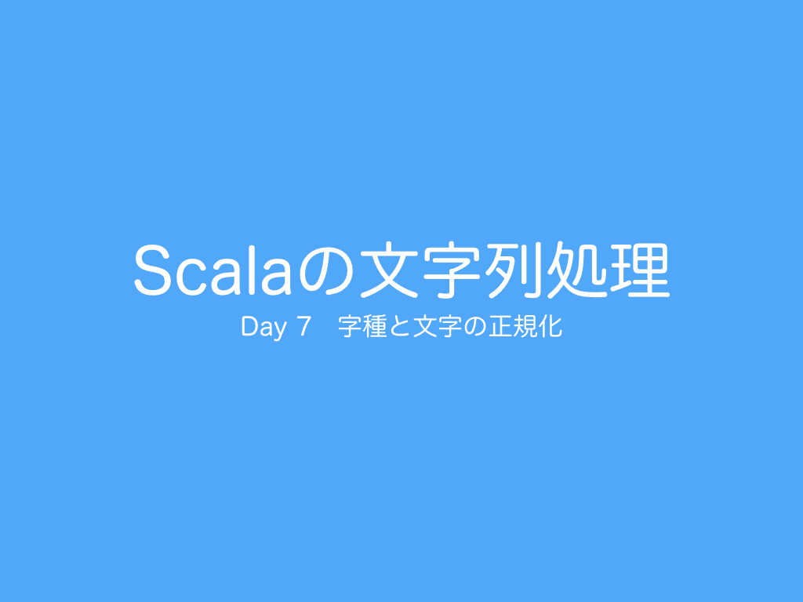

# Day 7 字種と文字の正規化
 
今日は、字種と文字の正規化について紹介したいと思います。  
<h2>学習方法</h2>
<a href="http://ynupc.github.io/course/scalastringcourse/index.html" target="_blank">Scalaの文字列処理</a>
<h2><a href="SUMMARY.md">目次（読み物）</a></h2>
<h2>動画</h2>
<h2>スライド</h2>
<iframe src="//www.slideshare.net/slideshow/embed_code/key/1RnBkyaPuUHjmJ" width="595" height="485" frameborder="0" marginwidth="0" marginheight="0" scrolling="no" style="border:1px solid #CCC; border-width:1px; margin-bottom:5px; max-width: 100%;" allowfullscreen> </iframe> 
 <strong> <a href="//www.slideshare.net/ynupc/scala-day-7" title="Scalaの文字列処理 Day 7 字種と文字の正規化" target="_blank">Scalaの文字列処理 Day 7 字種と文字の正規化</a> </strong> from <strong><a target="_blank" href="//www.slideshare.net/ynupc">ynupc</a></strong> 

<h2>リポジトリ（サンプルコード）</h2>
<a href="https://github.com/ynupc/scalastringcourseday7" target="_blank">https://github.com/ynupc/scalastringcourseday7</a>
<h2>クイズ</h2>
<a href="http://ynupc.github.io/course/scalastringcourse/day7/" target="_blank">http://ynupc.github.io/course/scalastringcourse/day7/</a>
<h2>アンケート</h2>
