# 1.　字種
<h3>1.1　Unicodeコードポイントのグループ分け</h3>
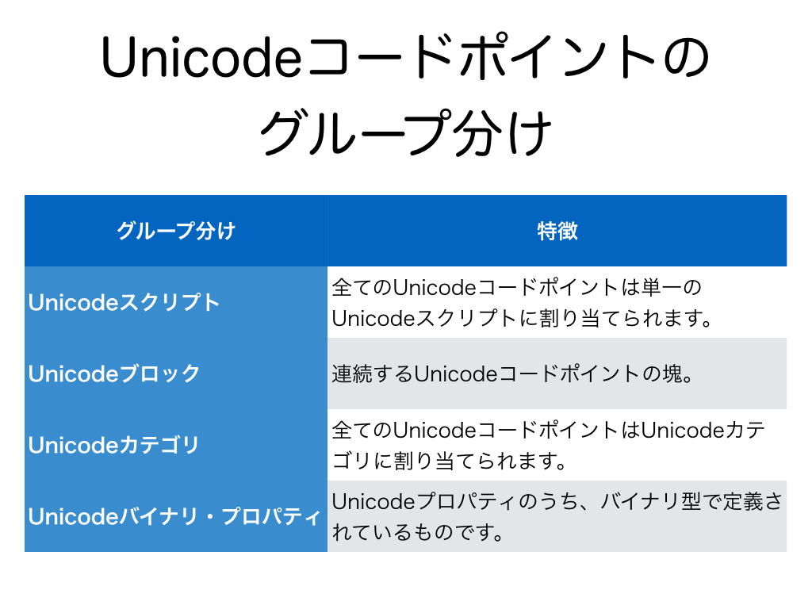<br>
Unicodeコードポイントのグループ分けには、Unicodeスクリプト、ブロック、カテゴリ、バイナリ・プロパティがあります。
<table>
<tr><th>Unicodeコードポイントのグループ分け</th><th>特徴</th></tr>
<tr><td>Unicodeスクリプト</td><td>全てのUnicodeコードポイントは単一のUnicodeスクリプトに割り当てられます。<br>rf. <a href="http://www.unicode.org/reports/tr24/tr24-24.html" target="_blank">Unicode® Standard Annex #24 UNICODE SCRIPT PROPERTY</a></td></tr>
<tr><td>Unicodeブロック</td><td>連続するUnicodeコードポイントの塊。全てのUnicodeブロックはUnicodeコードポイントの下限と上限で定義されます。<br>rf. <a href="http://www.unicode.org/Public/UCD/latest/ucd/Blocks.txt" target="_blank">Character Block Property Data File</a></td></tr>
<tr><td>Unicodeカテゴリ</td><td>全てのUnicodeコードポイントは一般カテゴリに割り当てられます。そして、全てのUnicodeコードポイントはサブカテゴリにも割り当てられます。<br>rf. <a href="http://unicode.org/reports/tr44/#General_Category_Values" target="_blank">5.7.1 General Category Values - Unicode® Standard Annex #44 UNICODE CHARACTER DATABASE</a></td></tr>
<tr><td>Unicodeバイナリ・プロパティ</td><td>Unicodeプロパティのうち、バイナリ型で定義されているものです。そのうちの一部がJavaの正規表現で定義されています。<br>
rf.<br>
<ul>
<li><a href="http://www.unicode.org/reports/tr44/#Property_List_Table" target="_blank">Table 9. Property Table - Unicode® Standard Annex #44 UNICODE CHARACTER DATABASE</a></li>
<li><a href="http://www.unicode.org/Public/UCD/latest/ucd/PropList.txt" target="_blank">PropList.txt</a></li>
</ul>
</td></tr>
</table>
***
<h3>1.1.1　Unicodeスクリプト</h3>
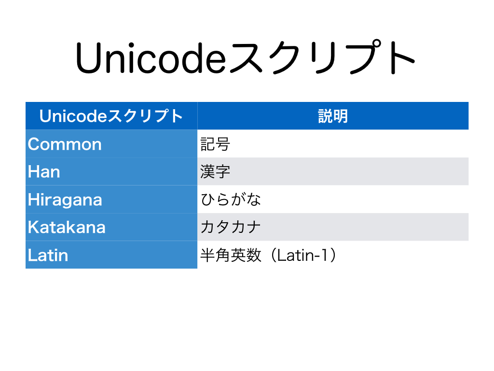<br>
Unicodeスクリプトは<a href="http://www.unicode.org/reports/tr24/" target="_blank">Unicode Standard Annex#24: Script Names</a>で規定されており、すべてのUnicode文字は、単一のUnicodeスクリプト(Latinなどの特定のスクリプトか、3つの特殊値Common、Inherited、Unknownのいずれか)に割り当てられます。
<table>
<tr><th>特殊なスクリプト</th><th>説明</th></tr>
<tr><td>Common</td><td>用字をまたがって共通に使うスクリプト</td></tr>
<tr><td>Inherite</td><td>隣接した文字からスクリプトを受け継ぐスクリプト</td></tr>
<tr><td>Unknown</td><td>未知のスクリプト</td></tr>
</table>

<table>
<tr><th>Unicodeスクリプト</th><th>java.lang.Character.UnicodeScript</th></tr>
<tr><td>Arabic</td><td>ARABIC</td></tr>
<tr><td>Armenian</td><td>ARMENIAN</td></tr>
<tr><td>Avestan</td><td>AVESTAN</td></tr>
<tr><td>Balinese</td><td>BALINESE</td></tr>
<tr><td>Bamum</td><td>BAMUM</td></tr>
<tr><td>Batak</td><td>BATAK</td></tr>
<tr><td>Bengali</td><td>BENGALI</td></tr>
<tr><td>Bopomofo</td><td>BOPOMOFO</td></tr>
<tr><td>Brahmi</td><td>BRAHMI</td></tr>
<tr><td>Braille</td><td>BRAILLE</td></tr>
<tr><td>Buginese</td><td>BUGINESE</td></tr>
<tr><td>Buhid</td><td>BUHID</td></tr>
<tr><td>Canadian_Aboriginal</td><td>CANADIAN_ABORIGINAL</td></tr>
<tr><td>Carian</td><td>CARIAN</td></tr>
<tr><td>Chakma</td><td>CHAKMA</td></tr>
<tr><td>Cham</td><td>CHAM</td></tr>
<tr><td>Cherokee</td><td>CHEROKEE</td></tr>
<tr><td><strong><i>Common</i></strong></td><td><strong><i>COMMON</i></strong></td></tr>
<tr><td>Coptic</td><td>COPTIC</td></tr>
<tr><td>Cuneiform</td><td>CUNEIFORM</td></tr>
<tr><td>Cypriot</td><td>CYPRIOT</td></tr>
<tr><td>Cyrillic</td><td>CYRILLIC</td></tr>
<tr><td>Deseret</td><td>DESERET</td></tr>
<tr><td>Devanagari</td><td>DEVANAGARI</td></tr>
<tr><td>Egyptian_Hieroglyphs</td><td>EGYPTIAN_HIEROGLYPHS</td></tr>
<tr><td>Ethiopic</td><td>ETHIOPIC</td></tr>
<tr><td>Georgian</td><td>GEORGIAN</td></tr>
<tr><td>Glagolitic</td><td>GLAGOLITIC</td></tr>
<tr><td>Gothic</td><td>GOTHIC</td></tr>
<tr><td>Greek</td><td>GREEK</td></tr>
<tr><td>Gujarati</td><td>GUJARATI</td></tr>
<tr><td>Gurmukhi</td><td>GURMUKHI</td></tr>
<tr><td><strong>Han</strong></td><td><strong>HAN</strong></td></tr>
<tr><td>Hangul</td><td>HANGUL</td></tr>
<tr><td>Hanunoo</td><td>HANUNOO</td></tr>
<tr><td>Hebrew</td><td>HEBREW</td></tr>
<tr><td><strong>Hiragana</strong></td><td><strong>HIRAGANA</strong></td></tr>
<tr><td>Imperial_Aramaic</td><td>IMPERIAL_ARAMAIC</td></tr>
<tr><td><strong><i>Inherited</i></strong></td><td><strong><i>INHERITED</i></strong></td></tr>
<tr><td>Inscriptional_Pahlavi</td><td>INSCRIPTIONAL_PAHLAVI</td></tr>
<tr><td>Inscriptional_Parthian</td><td>INSCRIPTIONAL_PARTHIAN</td></tr>
<tr><td>Javanese</td><td>JAVANESE</td></tr>
<tr><td>Kaithi</td><td>KAITHI</td></tr>
<tr><td>Kannada</td><td>KANNADA</td></tr>
<tr><td><strong>Katakana</strong></td><td><strong>KATAKANA</strong></td></tr>
<tr><td>Kayah_Li</td><td>KAYAH_LI</td></tr>
<tr><td>Kharoshthi</td><td>KHAROSHTHI</td></tr>
<tr><td>Khmer</td><td>KHMER</td></tr>
<tr><td>Lao</td><td>LAO</td></tr>
<tr><td><strong>Latin</strong></td><td><strong>LATIN</strong></td></tr>
<tr><td>Lepcha</td><td>LEPCHA</td></tr>
<tr><td>Limbu</td><td>LIMBU</td></tr>
<tr><td>Linear_B</td><td>LINEAR_B</td></tr>
<tr><td>Lisu</td><td>LISU</td></tr>
<tr><td>Lycian</td><td>LYCIAN</td></tr>
<tr><td>Lydian</td><td>LYDIAN</td></tr>
<tr><td>Malayalam</td><td>MALAYALAM</td></tr>
<tr><td>Mandaic</td><td>MANDAIC</td></tr>
<tr><td>Meetei_Mayek</td><td>MEETEI_MAYEK</td></tr>
<tr><td>Meroitic Cursive</td><td>MEROITIC_CURSIVE</td></tr>
<tr><td>Meroitic Hieroglyphs</td><td>MEROITIC_HIEROGLYPHS</td></tr>
<tr><td>Miao</td><td>MIAO</td></tr>
<tr><td>Mongolian</td><td>MONGOLIAN</td></tr>
<tr><td>Myanmar</td><td>Myanmar</td></tr>
<tr><td>New_Tai_Lue</td><td>NEW_TAI_LUE</td></tr>
<tr><td>Nko</td><td>NKO</td></tr>
<tr><td>Ogham</td><td>OGHAM</td></tr>
<tr><td>Ol_Chiki</td><td>OL_CHIKI</td></tr>
<tr><td>Old_Italic</td><td>OLD_ITALIC</td></tr>
<tr><td>Old_Persian</td><td>OLD_PERSIAN</td></tr>
<tr><td>Old_South_Arabian</td><td>OLD_SOUTH_ARABIAN</td></tr>
<tr><td>Old_Turkic</td><td>OLD_TURKIC</td></tr>
<tr><td>Oriya</td><td>ORIYA</td></tr>
<tr><td>Osmanya</td><td>OSMANYA</td></tr>
<tr><td>Phags_Pa</td><td>PHAGS_PA</td></tr>
<tr><td>Phoenician</td><td>PHOENICIAN</td></tr>
<tr><td>Rejang</td><td>REJANG</td></tr>
<tr><td>Runic</td><td>RUNIC</td></tr>
<tr><td>Samaritan</td><td>SAMARITAN</td></tr>
<tr><td>Saurashtra</td><td>SAURASHTRA</td></tr>
<tr><td>Sharada</td><td>SHARADA</td></tr>
<tr><td>Shavian</td><td>SHAVIAN</td></tr>
<tr><td>Sinhala</td><td>SINHALA</td></tr>
<tr><td>Sora Sompeng</td><td>SORA_SOMPENG</td></tr>
<tr><td>Sundanese</td><td>SUNDANESE</td></tr>
<tr><td>Syloti_Nagri</td><td>SYLOTI_NAGRI</td></tr>
<tr><td>Syriac</td><td>SYRIAC</td></tr>
<tr><td>Tagalog</td><td>TAGALOG</td></tr>
<tr><td>Tagbanwa</td><td>TAGBANWA</td></tr>
<tr><td>Tai_Le</td><td>TAI_LE</td></tr>
<tr><td>Tai_Tham</td><td>TAI_THAM</td></tr>
<tr><td>Tai_Viet</td><td>TAI_VIET</td></tr>
<tr><td>Takri</td><td>TAKRI</td></tr>
<tr><td>Tamil</td><td>TAMIL</td></tr>
<tr><td>Telugu</td><td>TELUGU</td></tr>
<tr><td>Thaana</td><td>THAANA</td></tr>
<tr><td>Thai</td><td>THAI</td></tr>
<tr><td>Tibetan</td><td>TIBETAN</td></tr>
<tr><td>Tifinagh</td><td>TIFINAGH</td></tr>
<tr><td>Ugaritic</td><td>UGARITIC</td></tr>
<tr><td><strong><i>Unknown</i></strong></td><td><strong><i>UNKNOWN</i></strong></td></tr>
<tr><td>Vai</td><td>VAI</td></tr>
<tr><td>Yi</td><td>YI</td></tr>
</table>
```scala
  @Test
  def testCharacterUnicodeScriptOf(): Unit = {
    assert(Character.UnicodeScript.of(hiraganaCodePoint) == Character.UnicodeScript.HIRAGANA)
    assert(Character.UnicodeScript.of(katakanaCodePoint) == Character.UnicodeScript.KATAKANA)
    assert(Character.UnicodeScript.of(kanjiCodePoint)    == Character.UnicodeScript.HAN)
    assert(Character.UnicodeScript.of(alphabetCodePoint) == Character.UnicodeScript.LATIN)
    assert(Character.UnicodeScript.of(symbolCodePoint)   == Character.UnicodeScript.COMMON)
  }
```
***
<h3>1.1.2　Unicodeブロック</h3>
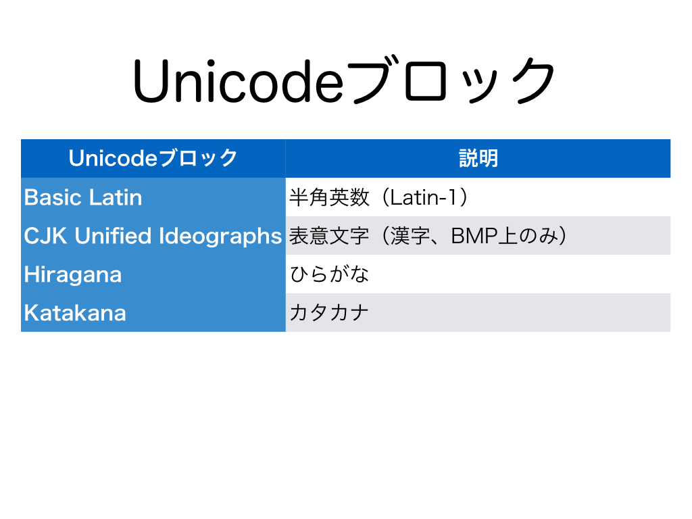<br>
全てのUnicodeブロックはUnicodeコードポイントの下限と上限で定義されます。
各Unicodeブロックの下限と上限のUnicodeコードポイントは「<a href="http://www.unicode.org/Public/UCD/latest/ucd/Blocks.txt" target="_blank">Character Block Property Data File</a>」で確認できます。
<table>
<tr><th>Unicodeブロック</th><th>java.lang.Character.UnicodeBlock</th></tr>
<tr><td>Aegean Numbers</td><td>AEGEAN_NUMBERS</td></tr>
<tr><td>Alchemical Symbols</td><td>ALCHEMICAL_SYMBOLS</td></tr>
<tr><td>Alphabetic Presentation Forms</td><td>ALPHABETIC_PRESENTATION_FORMS</td></tr>
<tr><td>Ancient Greek Musical Notation</td><td>ANCIENT_GREEK_MUSICAL_NOTATION</td></tr>
<tr><td>Ancient Greek Numbers</td><td>ANCIENT_GREEK_NUMBERS</td></tr>
<tr><td>Ancient Symbols</td><td>ANCIENT_SYMBOLS</td></tr>
<tr><td>Arabic</td><td>ARABIC</td></tr>
<tr><td>Arabic Extended-A</td><td>ARABIC_EXTENDED_A</td></tr>
<tr><td>Arabic Mathematical Alphabetic Symbols</td><td>ARABIC_MATHEMATICAL_ALPHABETIC_SYMBOLS</td></tr>
<tr><td>Arabic Presentation Forms-A</td><td>ARABIC_PRESENTATION_FORMS_A</td></tr>
<tr><td>Arabic Presentation Forms-B</td><td>ARABIC_PRESENTATION_FORMS_B</td></tr>
<tr><td>Arabic Supplement</td><td>ARABIC_SUPPLEMENT</td></tr>
<tr><td>Armenian</td><td>ARMENIAN</td></tr>
<tr><td>Arrows</td><td>ARROWS</td></tr>
<tr><td>Avestan</td><td>AVESTAN</td></tr>
<tr><td>Balinese</td><td>BALINESE</td></tr>
<tr><td>Bamum</td><td>BAMUM</td></tr>
<tr><td>Bamum Supplement</td><td>BAMUM_SUPPLEMENT</td></tr>
<tr><td><strong>Basic Latin</strong></td><td><strong>BASIC_LATIN</strong></td></tr>
<tr><td>Batak</td><td>BATAK</td></tr>
<tr><td>Bengali</td><td>BENGALI</td></tr>
<tr><td>Block Elements</td><td>BLOCK_ELEMENTS</td></tr>
<tr><td>Bopomofo</td><td>BOPOMOFO</td></tr>
<tr><td>Bopomofo Extended</td><td>BOPOMOFO_EXTENDED</td></tr>
<tr><td>Box Drawing</td><td>BOX_DRAWING</td></tr>
<tr><td>Brahmi</td><td>BRAHMI</td></tr>
<tr><td>Braille Patterns</td><td>BRAILLE_PATTERNS</td></tr>
<tr><td>Buginese</td><td>BUGINESE</td></tr>
<tr><td>Buhid</td><td>BUHID</td></tr>
<tr><td>Byzantine Musical Symbols</td><td>BYZANTINE_MUSICAL_SYMBOLS</td></tr>
<tr><td>Carian</td><td>CARIAN</td></tr>
<tr><td>Cham</td><td>CHAM</td></tr>
<tr><td>Cherokee</td><td>CHEROKEE</td></tr>
<tr><td>CJK Compatibility</td><td>CJK_COMPATIBILITY</td></tr>
<tr><td>CJK Compatibility Forms</td><td>CJK_COMPATIBILITY_FORMS</td></tr>
<tr><td><strong>CJK Compatibility Ideographs</strong></td><td><strong>CJK_COMPATIBILITY_IDEOGRAPHS</strong></td></tr>
<tr><td><strong>CJK Compatibility Ideographs Supplement</strong></td><td><strong>CJK_COMPATIBILITY_IDEOGRAPHS_SUPPLEMENT</strong></td></tr>
<tr><td><strong>CJK Radicals Supplement</strong></td><td><strong>CJK_RADICALS_SUPPLEMENT</strong></td></tr>
<tr><td><strong>CJK Strokes</strong></td><td><strong>CJK_STROKES</strong></td></tr>
<tr><td><strong>CJK Symbols and Punctuation</strong></td><td><strong>CJK_SYMBOLS_AND_PUNCTUATION</strong></td></tr>
<tr><td><strong>CJK Unified Ideographs</strong></td><td><strong><strong>CJK_UNIFIED_IDEOGRAPHS</strong></td></tr>
<tr><td><strong>CJK Unified Ideographs Extension A</strong></td><td><strong>CJK_UNIFIED_IDEOGRAPHS_EXTENSION_A</strong></td></tr>
<tr><td><strong>CJK Unified Ideographs Extension B</strong></td><td><strong>CJK_UNIFIED_IDEOGRAPHS_EXTENSION_B</strong></td></tr>
<tr><td><strong>CJK Unified Ideographs Extension C</strong></td><td><strong>CJK_UNIFIED_IDEOGRAPHS_EXTENSION_C</strong></td></tr>
<tr><td><strong>CJK Unified Ideographs Extension D</strong></td><td><strong>CJK_UNIFIED_IDEOGRAPHS_EXTENSION_D</strong></td></tr>
<tr><td>Combining Diacritical Marks</td><td>COMBINING_DIACRITICAL_MARKS</td></tr>
<tr><td>Combining Diacritical Marks Supplement</td><td>COMBINING_DIACRITICAL_MARKS_SUPPLEMENT</td></tr>
<tr><td>Combining Half Marks</td><td>COMBINING_HALF_MARKS</td></tr>
<tr><td>Combining Diacritical Marks for Symbols</td><td>COMBINING_MARKS_FOR_SYMBOLS</td></tr>
<tr><td>Common Indic Number Forms</td><td>COMMON_INDIC_NUMBER_FORMS</td></tr>
<tr><td>Control Pictures</td><td>CONTROL_PICTURES</td></tr>
<tr><td>Coptic</td><td>COPTIC</td></tr>
<tr><td>Counting Rod Numerals</td><td>COUNTING_ROD_NUMERALS</td></tr>
<tr><td>Cuneiform</td><td>CUNEIFORM</td></tr>
<tr><td>Cuneiform Numbers and Punctuation</td><td>CUNEIFORM_NUMBERS_AND_PUNCTUATION</td></tr>
<tr><td>Currency Symbols</td><td>CURRENCY_SYMBOLS</td></tr>
<tr><td>Cypriot Syllabary</td><td>CYPRIOT_SYLLABARY</td></tr>
<tr><td>Cyrillic</td><td>CYRILLIC</td></tr>
<tr><td>Cyrillic Extended-A</td><td>CYRILLIC_EXTENDED_A</td></tr>
<tr><td>Cyrillic Extended-B</td><td>CYRILLIC_EXTENDED_B</td></tr>
<tr><td>Cyrillic Supplementary</td><td>CYRILLIC_SUPPLEMENTARY</td></tr>
<tr><td>Deseret</td><td>DESERET</td></tr>
<tr><td>Devanagari</td><td>DEVANAGARI</td></tr>
<tr><td>Devanagari Extended</td><td>DEVANAGARI_EXTENDED</td></tr>
<tr><td>Dingbats</td><td>DINGBATS</td></tr>
<tr><td>Domino Tiles</td><td>DOMINO_TILES</td></tr>
<tr><td>Egyptian Hieroglyphs</td><td>EGYPTIAN_HIEROGLYPHS</td></tr>
<tr><td>Emoticons</td><td>EMOTICONS</td></tr>
<tr><td>Enclosed Alphanumeric Supplement</td><td>ENCLOSED_ALPHANUMERIC_SUPPLEMENT</td></tr>
<tr><td>Enclosed Alphanumerics</td><td>ENCLOSED_ALPHANUMERICS</td></tr>
<tr><td>Enclosed CJK Letters and Months</td><td>ENCLOSED_CJK_LETTERS_AND_MONTHS</td></tr>
<tr><td>Enclosed Ideographic Supplement</td><td>ENCLOSED_IDEOGRAPHIC_SUPPLEMENT</td></tr>
<tr><td>Ethiopic</td><td>ETHIOPIC</td></tr>
<tr><td>Ethiopic Extended</td><td>ETHIOPIC_EXTENDED</td></tr>
<tr><td>Ethiopic Extended-A</td><td>ETHIOPIC_EXTENDED_A</td></tr>
<tr><td>Ethiopic Supplement</td><td>ETHIOPIC_SUPPLEMENT</td></tr>
<tr><td>General Punctuation</td><td>GENERAL_PUNCTUATION</td></tr>
<tr><td>Geometric Shapes</td><td>GEOMETRIC_SHAPES</td></tr>
<tr><td>Georgian</td><td>GEORGIAN</td></tr>
<tr><td>Georgian Supplement</td><td>GEORGIAN_SUPPLEMENT</td></tr>
<tr><td>Glagolitic</td><td>GLAGOLITIC</td></tr>
<tr><td>Gothic</td><td>GOTHIC</td></tr>
<tr><td>Greek and Coptic</td><td>GREEK</td></tr>
<tr><td>Greek Extended</td><td>GREEK_EXTENDED</td></tr>
<tr><td>Gujarati</td><td>GUJARATI</td></tr>
<tr><td>Gurmukhi</td><td>GURMUKHI</td></tr>
<tr><td>Halfwidth and Fullwidth Forms</td><td>HALFWIDTH_AND_FULLWIDTH_FORMS</td></tr>
<tr><td>Hangul Compatibility Jamo</td><td>HANGUL_COMPATIBILITY_JAMO</td></tr>
<tr><td>Hangul Jamo</td><td>HANGUL_JAMO</td></tr>
<tr><td>Hangul Jamo Extended-A</td><td>HANGUL_JAMO_EXTENDED_A</td></tr>
<tr><td>Hangul Jamo Extended-B</td><td>HANGUL_JAMO_EXTENDED_B</td></tr>
<tr><td>Hangul Syllables</td><td>HANGUL_SYLLABLES</td></tr>
<tr><td>Hanunoo</td><td>HANUNOO</td></tr>
<tr><td>Hebrew</td><td>HEBREW</td></tr>
<tr><td><strong>Hiragana</strong></td><td><strong>HIRAGANA</strong></td></tr>
<tr><td><strong>Ideographic Description Characters</strong></td><td><strong>IDEOGRAPHIC_DESCRIPTION_CHARACTERS</strong></td></tr>
<tr><td>Imperial Aramaic</td><td>IMPERIAL_ARAMAIC</td></tr>
<tr><td>Inscriptional Pahlavi</td><td>INSCRIPTIONAL_PAHLAVI</td></tr>
<tr><td>Inscriptional Parthian</td><td>INSCRIPTIONAL_PARTHIAN</td></tr>
<tr><td>IPA Extensions</td><td>IPA_EXTENSIONS</td></tr>
<tr><td>Javanese</td><td>JAVANESE</td></tr>
<tr><td>Kaithi</td><td>KAITHI</td></tr>
<tr><td><strong>Kana Supplement</strong></td><td><strong>KANA_SUPPLEMENT</strong></td></tr>
<tr><td><strong>Kanbun</strong></td><td><strong>KANBUN</strong></td></tr>
<tr><td>Kangxi Radicals</td><td>KANGXI_RADICALS</td></tr>
<tr><td>Kannada</td><td>KANNADA</td></tr>
<tr><td><strong>Katakana</strong></td><td><strong>KATAKANA</strong></td></tr>
<tr><td><strong>Katakana Phonetic Extensions</strong></td><td><strong>KATAKANA_PHONETIC_EXTENSIONS</strong></td></tr>
<tr><td>Kayah Li</td><td>KAYAH_LI</td></tr>
<tr><td>Kharoshthi</td><td>KHAROSHTHI</td></tr>
<tr><td>Khmer</td><td>KHMER</td></tr>
<tr><td>Khmer Symbols</td><td>KHMER_SYMBOLS</td></tr>
<tr><td>Lao</td><td>LAO</td></tr>
<tr><td>Latin-1 Supplement</td><td>LATIN_1_SUPPLEMENT</td></tr>
<tr><td>Latin Extended-A</td><td>LATIN_EXTENDED_A</td></tr>
<tr><td>Latin Extended Additional</td><td>LATIN_EXTENDED_ADDITIONAL</td></tr>
<tr><td>Latin Extended-B</td><td>LATIN_EXTENDED_B</td></tr>
<tr><td>Latin Extended-C</td><td>LATIN_EXTENDED_C</td></tr>
<tr><td>Latin Extended-D</td><td>LATIN_EXTENDED_D</td></tr>
<tr><td>Lepcha</td><td>LEPCHA</td></tr>
<tr><td>Letterlike Symbols</td><td>LETTERLIKE_SYMBOLS</td></tr>
<tr><td>Limbu</td><td>LIMBU</td></tr>
<tr><td>Linear B Ideograms</td><td>LINEAR_B_IDEOGRAMS</td></tr>
<tr><td>Linear B Syllabary</td><td>LINEAR_B_SYLLABARY</td></tr>
<tr><td>Lisu</td><td>LISU</td></tr>
<tr><td>Lycian</td><td>LYCIAN</td></tr>
<tr><td>Lydian</td><td>LYDIAN</td></tr>
<tr><td>Mahjong Tiles</td><td>MAHJONG_TILES</td></tr>
<tr><td>Malayalam</td><td>MALAYALAM</td></tr>
<tr><td>Mandaic</td><td>MANDAIC</td></tr>
<tr><td>Mathematical Alphanumeric Symbols</td><td>MATHEMATICAL_ALPHANUMERIC_SYMBOLS</td></tr>
<tr><td>Mathematical Operators</td><td>MATHEMATICAL_OPERATORS</td></tr>
<tr><td>Meetei Mayek</td><td>MEETEI_MAYEK</td></tr>
<tr><td>Meetei Mayek Extensions</td><td>MEETEI_MAYEK_EXTENSIONS</td></tr>
<tr><td>Meroitic Cursive</td><td>MEROITIC_CURSIVE</td></tr>
<tr><td>Meroitic Hieroglyphs</td><td>MEROITIC_HIEROGLYPHS</td></tr>
<tr><td>Miao</td><td>MIAO</td></tr>
<tr><td>Miscellaneous Mathematical Symbols-A</td><td>MISCELLANEOUS_MATHEMATICAL_SYMBOLS_A</td></tr>
<tr><td>Miscellaneous Mathematical Symbols-B</td><td>MISCELLANEOUS_MATHEMATICAL_SYMBOLS_B</td></tr>
<tr><td>Miscellaneous Symbols</td><td>MISCELLANEOUS_SYMBOLS</td></tr>
<tr><td>Miscellaneous Symbols and Arrows</td><td>MISCELLANEOUS_SYMBOLS_AND_ARROWS</td></tr>
<tr><td>Miscellaneous Symbols And Pictographs</td><td>MISCELLANEOUS_SYMBOLS_AND_PICTOGRAPHS</td></tr>
<tr><td>Miscellaneous Technical</td><td>MISCELLANEOUS_TECHNICAL</td></tr>
<tr><td>Modifier Tone Letters</td><td>MODIFIER_TONE_LETTERS</td></tr>
<tr><td>Mongolian</td><td>MONGOLIAN</td></tr>
<tr><td>Musical Symbols</td><td>MUSICAL_SYMBOLS</td></tr>
<tr><td>Myanmar</td><td>MYANMAR</td></tr>
<tr><td>Myanmar Extended-A</td><td>MYANMAR_EXTENDED_A</td></tr>
<tr><td>New Tai Lue</td><td>NEW_TAI_LUE</td></tr>
<tr><td>NKo</td><td>NKO</td></tr>
<tr><td>Number Forms</td><td>NUMBER_FORMS</td></tr>
<tr><td>Ogham</td><td>OGHAM</td></tr>
<tr><td>Ol Chiki</td><td>OL_CHIKI</td></tr>
<tr><td>Old Italic</td><td>OLD_ITALIC</td></tr>
<tr><td>Old Persian</td><td>OLD_PERSIAN</td></tr>
<tr><td>Old South Arabian</td><td>OLD_SOUTH_ARABIAN</td></tr>
<tr><td>Old Turkic</td><td>OLD_TURKIC</td></tr>
<tr><td>Optical Character Recognition</td><td>OPTICAL_CHARACTER_RECOGNITION</td></tr>
<tr><td>Oriya</td><td>ORIYA</td></tr>
<tr><td>Osmanya</td><td>OSMANYA</td></tr>
<tr><td>Phags-pa</td><td>PHAGS_PA</td></tr>
<tr><td>Phaistos Disc</td><td>PHAISTOS_DISC</td></tr>
<tr><td>Phoenician</td><td>PHOENICIAN</td></tr>
<tr><td>Phonetic Extensions</td><td>PHONETIC_EXTENSIONS</td></tr>
<tr><td>Phonetic Extensions Supplement</td><td>PHONETIC_EXTENSIONS_SUPPLEMENT</td></tr>
<tr><td>Playing Cards</td><td>PLAYING_CARDS</td></tr>
<tr><td>Private Use Area</td><td>PRIVATE_USE_AREA</td></tr>
<tr><td>Rejang</td><td>REJANG</td></tr>
<tr><td>Rumi Numeral Symbols</td><td>RUMI_NUMERAL_SYMBOLS</td></tr>
<tr><td>Runic</td><td>RUNIC</td></tr>
<tr><td>Samaritan</td><td>SAMARITAN</td></tr>
<tr><td>Saurashtra</td><td>SAURASHTRA</td></tr>
<tr><td>Sharada</td><td>SHARADA</td></tr>
<tr><td>Shavian</td><td>SHAVIAN</td></tr>
<tr><td>Sinhala</td><td>SINHALA</td></tr>
<tr><td>Small Form Variants</td><td>SMALL_FORM_VARIANTS</td></tr>
<tr><td>Sora Sompeng</td><td>SORA_SOMPENG</td></tr>
<tr><td>Spacing Modifier Letters</td><td>SPACING_MODIFIER_LETTERS</td></tr>
<tr><td>Specials</td><td>SPECIALS</td></tr>
<tr><td>Sundanese</td><td>SUNDANESE</td></tr>
<tr><td>Sundanese Supplement</td><td>SUNDANESE_SUPPLEMENT</td></tr>
<tr><td>Superscripts and Subscripts</td><td>SUPERSCRIPTS_AND_SUBSCRIPTS</td></tr>
<tr><td>Supplemental Arrows-A</td><td>SUPPLEMENTAL_ARROWS_A</td></tr>
<tr><td>Supplemental Arrows-B</td><td>SUPPLEMENTAL_ARROWS_B</td></tr>
<tr><td>Supplemental Mathematical Operators</td><td>SUPPLEMENTAL_MATHEMATICAL_OPERATORS</td></tr>
<tr><td>Supplemental Punctuation</td><td>SUPPLEMENTAL_PUNCTUATION</td></tr>
<tr><td>Supplementary Private Use Area-A</td><td>SUPPLEMENTARY_PRIVATE_USE_AREA_A</td></tr>
<tr><td>Supplementary Private Use Area-B</td><td>SUPPLEMENTARY_PRIVATE_USE_AREA_B</td></tr>
<tr><td>Syloti Nagri</td><td>SYLOTI_NAGRI</td></tr>
<tr><td>Syriac</td><td>SYRIAC</td></tr>
<tr><td>Tagalog</td><td>TAGALOG</td></tr>
<tr><td>Tagbanwa</td><td>TAGBANWA</td></tr>
<tr><td>Tags</td><td>TAGS</td></tr>
<tr><td>Tai Le</td><td>TAI_LE</td></tr>
<tr><td>Tai Tham</td><td>TAI_THAM</td></tr>
<tr><td>Tai Viet</td><td>TAI_VIET</td></tr>
<tr><td>Tai Xuan Jing Symbols</td><td>TAI_XUAN_JING_SYMBOLS</td></tr>
<tr><td>Takri</td><td>TAKRI</td></tr>
<tr><td>Tamil</td><td>TAMIL</td></tr>
<tr><td>Telugu</td><td>TELUGU</td></tr>
<tr><td>Thaana</td><td>THAANA</td></tr>
<tr><td>Thai</td><td>THAI</td></tr>
<tr><td>Tibetan</td><td>TIBETAN</td></tr>
<tr><td>Tifinagh</td><td>TIFINAGH</td></tr>
<tr><td>Transport And Map Symbols</td><td>TRANSPORT_AND_MAP_SYMBOLS</td></tr>
<tr><td>Ugaritic</td><td>UGARITIC</td></tr>
<tr><td>Unified Canadian Aboriginal Syllabics</td><td>UNIFIED_CANADIAN_ABORIGINAL_SYLLABICS</td></tr>
<tr><td>Unified Canadian Aboriginal Syllabics Extended</td><td>UNIFIED_CANADIAN_ABORIGINAL_SYLLABICS_EXTENDED</td></tr>
<tr><td>Vai</td><td>VAI</td></tr>
<tr><td>Variation Selectors</td><td>VARIATION_SELECTORS</td></tr>
<tr><td>Variation Selectors Supplement</td><td>VARIATION_SELECTORS_SUPPLEMENT</td></tr>
<tr><td>Vedic Extensions</td><td>VEDIC_EXTENSIONS</td></tr>
<tr><td>Vertical Forms</td><td>VERTICAL_FORMS</td></tr>
<tr><td>Yi Radicals</td><td>YI_RADICALS</td></tr>
<tr><td>Yi Syllables</td><td>YI_SYLLABLES</td></tr>
<tr><td>Yijing Hexagram Symbols</td><td>YIJING_HEXAGRAM_SYMBOLS</td></tr>
</table>
```scala
  @Test
  def testCharacterUnicodeBlockOf(): Unit = {
    assert(Character.UnicodeBlock.of(hiraganaChar) == Character.UnicodeBlock.HIRAGANA)
    assert(Character.UnicodeBlock.of(katakanaChar) == Character.UnicodeBlock.KATAKANA)
    assert(Character.UnicodeBlock.of(kanjiChar)    == Character.UnicodeBlock.CJK_UNIFIED_IDEOGRAPHS)
    assert(Character.UnicodeBlock.of(alphabetChar) == Character.UnicodeBlock.BASIC_LATIN)
    assert(Character.UnicodeBlock.of(symbolChar)   == Character.UnicodeBlock.BASIC_LATIN)

    assert(Character.UnicodeBlock.of(hiraganaCodePoint) == Character.UnicodeBlock.HIRAGANA)
    assert(Character.UnicodeBlock.of(katakanaCodePoint) == Character.UnicodeBlock.KATAKANA)
    assert(Character.UnicodeBlock.of(kanjiCodePoint)    == Character.UnicodeBlock.CJK_UNIFIED_IDEOGRAPHS)
    assert(Character.UnicodeBlock.of(alphabetCodePoint) == Character.UnicodeBlock.BASIC_LATIN)
    assert(Character.UnicodeBlock.of(symbolCodePoint)   == Character.UnicodeBlock.BASIC_LATIN)
  }
```
***
<h3>1.1.3　Unicodeカテゴリ</h3>
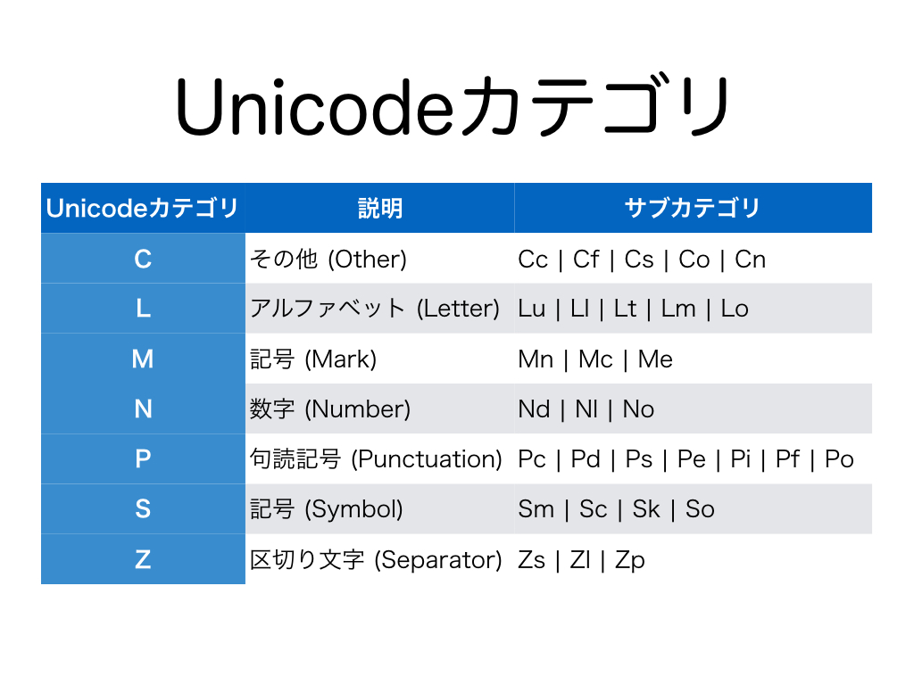<br>
全てのUnicodeコードポイントは一般カテゴリに割り当てられます。そして、全てのUnicodeコードポイントはサブカテゴリにも割り当てられます。<br>rf. <a href="http://unicode.org/reports/tr44/#General_Category_Values" target="_blank">5.7.1 General Category Values - Unicode® Standard Annex #44 UNICODE CHARACTER DATABASE</a><br><br>
一般カテゴリ
<table>
<tr><th>Unicodeカテゴリ</th><th>説明</th><th>サブカテゴリ</th></tr>
<tr><td>C</td><td>その他 (Other)</td><td>Cc | Cf | Cs | Co | Cn</td></tr>
<tr><td>L</td><td>アルファベット (Letter)</td><td>Lu | Ll | Lt | Lm | Lo</td></tr>
<tr><td>LC</td><td>case付きアルファベット（Cased Letter）</td><td>Lu | Ll | Lt</td></tr>
<tr><td>M</td><td>記号 (Mark)</td><td>Mn | Mc | Me</td></tr>
<tr><td>N</td><td>数字 (Number)</td><td>Nd | Nl | No</td></tr>
<tr><td>P</td><td>句読記号 (Punctuation)</td><td>Pc | Pd | Ps | Pe | Pi | Pf | Po</td></tr>
<tr><td>S</td><td>記号 (Symbol)</td><td>Sm | Sc | Sk | So</td></tr>
<tr><td>Z</td><td>区切り文字 (Separator)</td><td>Zs | Zl | Zp</td></tr>
</table>

サブカテゴリ
<table>
<tr><th>Unicodeカテゴリ</th><th>説明</th><th>java.lang.Character</th></tr>
<tr><td>Cc</td><td>C0/C1制御文字 (Control）</td><td>CONTROL</td></tr>
<tr><td>Cf</td><td>非可視整形用文字 (Format)</td><td>FORMAT</td></tr>
<tr><td>Cn</td><td>未定義コードポイント (Unassigned)</td><td>UNASSIGNED</td></tr>
<tr><td>Co</td><td>私的利用領域 (Private use)</td><td>PRIVATE_USE</td></tr>
<tr><td>Cs</td><td>サロゲート (Surrogate)</td><td>SURROGATE</td></tr>
<tr><td>Ll</td><td>小文字アルファベット (Lower case letter)</td><td>LOWERCASE_LETTER</td></tr>
<tr><td>Lm</td><td>擬似文字 (Modifier letter)</td><td>MODIFIER_LETTER</td></tr>
<tr><td>Lo</td><td>その他の文字 (Other letter)</td><td>OTHER_LETTER</td></tr>
<tr><td>Lt</td><td>タイトル文字 (Title case letter)</td><td>TITLECASE_LETTER</td></tr>
<tr><td>Lu</td><td>大文字アルファベット (Upper case letter)</td><td>UPPERCASE_LETTER</td></tr>
<tr><td>Mc</td><td>修飾文字 (Spacing mark)</td><td>COMBINING_SPACING_MARK</td></tr>
<tr><td>Me</td><td>他の文字を囲むための文字 (Enclosing mark)</td><td>ENCLOSING_MARK</td></tr>
<tr><td>Mn</td><td>他の文字を修飾するための文字 (Non-spacing mark)</td><td>NON_SPACING_MARK</td></tr>
<tr><td>Nd</td><td>10 進数字 (Decimal number)</td><td>DECIMAL_DIGIT_NUMBER</td></tr>
<tr><td>Nl</td><td>数値を表す文字 (Letter number)</td><td>LETTER_NUMBER</td></tr>
<tr><td>No</td><td>その他の数字 (Other number)</td><td>OTHER_NUMBER</td></tr>
<tr><td>Pd</td><td>連結用句読記号 (Connector punctuation)</td><td>DASH_PUNCTUATION</td></tr>
<tr><td>Pc</td><td>ダッシュ (Dash punctuation)</td><td>CONNECTOR_PUNCTUATION</td></tr>
<tr><td>Pe</td><td>閉じ句読記号 (Close punctuation)</td><td>END_PUNCTUATION</td></tr>
<tr><td>Pf</td><td>末尾句読記号 (Final punctuation)</td><td>FINAL_QUOTE_PUNCTUATION</td></tr>
<tr><td>Pi</td><td>先頭句読記号 (Initial punctuation)</td><td>INITIAL_QUOTE_PUNCTUATION</td></tr>
<tr><td>Po</td><td>その他の句読記号 (Other punctuation)</td><td>OTHER_PUNCTUATION</td></tr>
<tr><td>Ps</td><td>開き句読記号 (Open punctuation)</td><td>START_PUNCTUATION</td></tr>
<tr><td>Sc</td><td>通貨記号 (Currency symbol)</td><td>CURRENCY_SYMBOL</td></tr>
<tr><td>Sk</td><td>合わせ文字 (Modifier symbol)</td><td>MODIFIER_SYMBOL</td></tr>
<tr><td>Sm</td><td>数学記号 (Mathematical symbol)</td><td>MATH_SYMBOL</td></tr>
<tr><td>So</td><td>その他の記号 (Other symbol)</td><td>OTHER_SYMBOL</td></tr>
<tr><td>Zl</td><td>行区切り文字 (Line separator)、U+2028のみ</td><td>LINE_SEPARATOR</td></tr>
<tr><td>Zp</td><td>段落区切り文字 (Paragraph separator)、U+2029のみ</td><td>PARAGRAPH_SEPARATOR</td></tr>
<tr><td>Zs</td><td>空白文字 (Space separator)</td><td>SPACE_SEPARATOR</td></tr>
</table>
<br>
任意のCharやコードポイントからUnicodeカテゴリを取得するには、<a href="#142charactergettype">Character.getTypeメソッド</a>を使用します。
***
<h3>1.1.4　Unicodeバイナリ・プロパティ</h3>
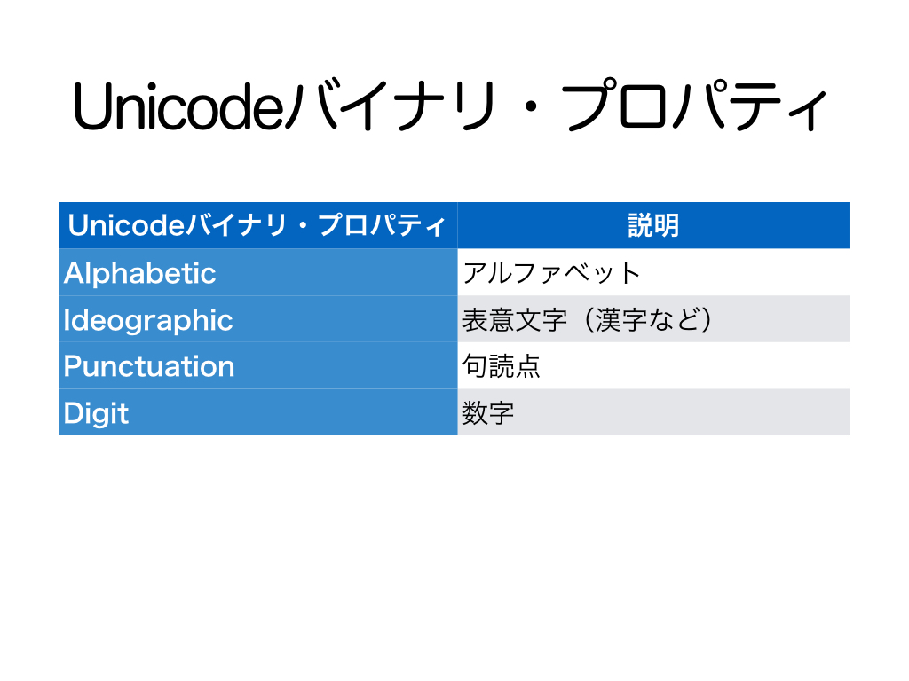<br>
Unicodeプロパティのうち、バイナリ型で定義されているものです。そのうち下記のものがJavaの正規表現で定義されています。
<table>
<tr><th>Unicodeバイナリ・プロパティ</th><th>説明</th></tr>
<tr><td>Alphabetic</td><td>アルファベット</td></tr>
<tr><td>Ideographic</td><td>表意文字（漢字など）</td></tr>
<tr><td>Letter</td><td>文字</td></tr>
<tr><td>Lowercase</td><td>lower caseの文字</td></tr>
<tr><td>Uppercase</td><td>upper caseの文字</td></tr>
<tr><td>Titlecase</td><td>title caseの文字</td></tr>
<tr><td>Punctuation</td><td>句読点</td></tr>
<tr><td>Control</td><td>制御文字</td></tr>
<tr><td>White_Space</td><td>空白文字</td></tr>
<tr><td>Digit</td><td>数字</td></tr>
<tr><td>Hex_Digit</td><td>16進数での数字</td></tr>
<tr><td>Join_Control</td><td>結合制御文字</td></tr>
<tr><td>Noncharacter_Code_Point</td><td>文字ではないコードポイント</td></tr>
<tr><td>Assigned</td><td>割り当てられた文字</td></tr>
</table>
***
<h3>1.2　java.lang.Characterクラスによる文字の字種情報の取得</h3>
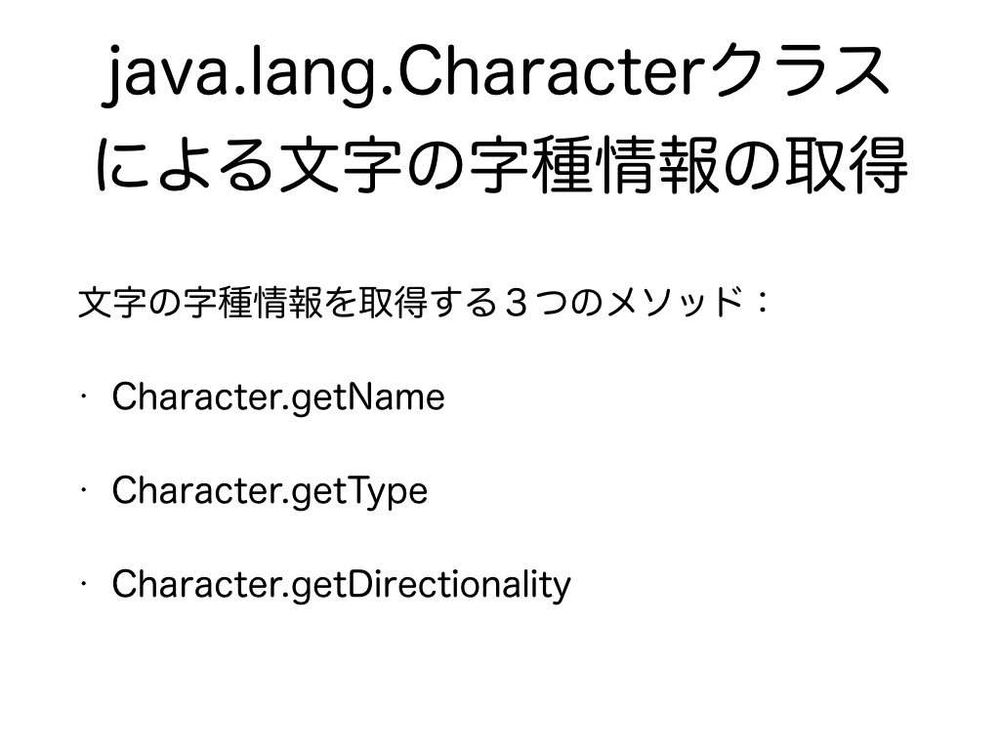<br>
java.lang.CharacterクラスのメソッドgetName、getType、getDirectionalityにより文字の字種情報を取得します。
<h4>1.2.1　Character.getName</h4>
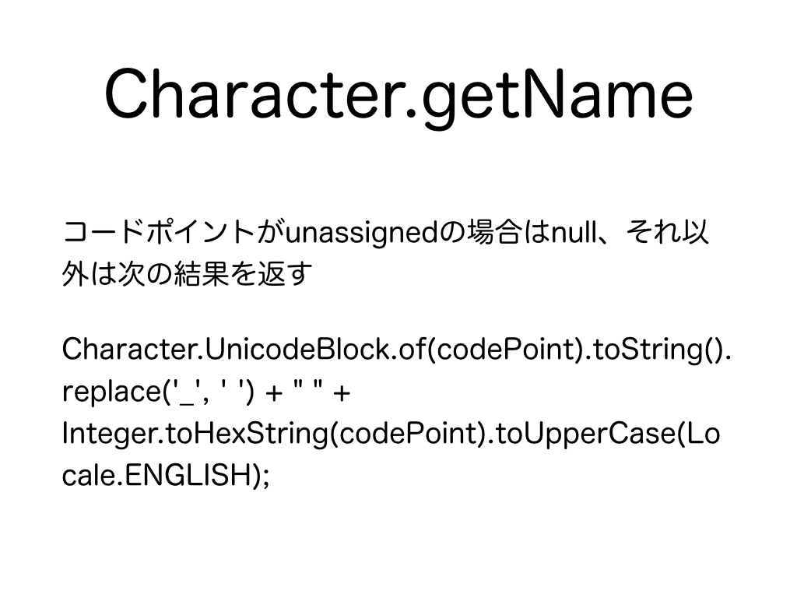<br>
Character.getNameメソッドは、コードポイントがunassignedの場合はnull、それ以外は次の結果を返します。
```java
Character.UnicodeBlock.of(codePoint).toString().replace('_', ' ') + " " + Integer.toHexString(codePoint).toUpperCase(Locale.ENGLISH);
```
```scala
  private val hiraganaChar: Char = 'か'
  private val katakanaChar: Char = 'カ'
  private val alphabetChar: Char = 'C'
  private val symbolChar:   Char = '+'

  private val hiraganaCodePoint: Int = Character.codePointAt(Array[Char](hiraganaChar), 0)
  private val katakanaCodePoint: Int = Character.codePointAt(Array[Char](katakanaChar), 0)
  private val alphabetCodePoint: Int = Character.codePointAt(Array[Char](alphabetChar), 0)
  private val symbolCodePoint:   Int = Character.codePointAt(Array[Char](symbolChar),   0)

  @Test
  def testCharacterClass(): Unit = {
    assert(Character.getName(hiraganaCodePoint) == "HIRAGANA LETTER KA")
    assert(Character.getName(katakanaCodePoint) == "KATAKANA LETTER KA")
    assert(Character.getName(alphabetCodePoint) == "LATIN CAPITAL LETTER C")
    assert(Character.getName(symbolCodePoint)   == "PLUS SIGN")
  }
```
***
<h4>1.2.2　Character.getType</h4>
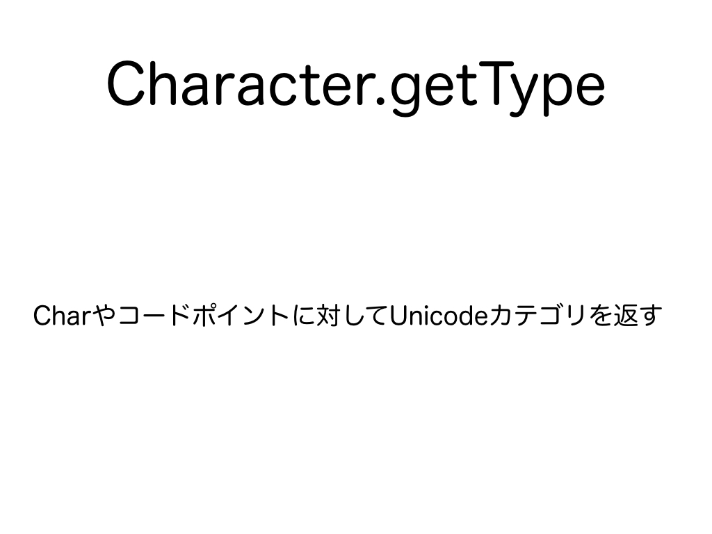<br>
Character.getTypeメソッドはCharやコードポイントに対して<a href="#18unicodeカテゴリ">Unicodeカテゴリ</a>を返します。
```scala
  private val hiraganaChar: Char = 'か'
  private val katakanaChar: Char = 'カ'
  private val alphabetChar: Char = 'C'
  private val symbolChar:   Char = '+'

  private val hiraganaCodePoint: Int = Character.codePointAt(Array[Char](hiraganaChar), 0)
  private val katakanaCodePoint: Int = Character.codePointAt(Array[Char](katakanaChar), 0)
  private val alphabetCodePoint: Int = Character.codePointAt(Array[Char](alphabetChar), 0)
  private val symbolCodePoint:   Int = Character.codePointAt(Array[Char](symbolChar),   0)
  
  @Test
  def testCharacterType(): Unit = {
    //index order
    assert( 0 == Character.UNASSIGNED)
    assert( 1 == Character.UPPERCASE_LETTER)
    assert( 2 == Character.LOWERCASE_LETTER)
    assert( 3 == Character.TITLECASE_LETTER)
    assert( 4 == Character.MODIFIER_LETTER)
    assert( 5 == Character.OTHER_LETTER)
    assert( 6 == Character.NON_SPACING_MARK)
    assert( 7 == Character.ENCLOSING_MARK)
    assert( 8 == Character.COMBINING_SPACING_MARK)
    assert( 9 == Character.DECIMAL_DIGIT_NUMBER)
    assert(10 == Character.LETTER_NUMBER)
    assert(11 == Character.OTHER_NUMBER)
    assert(12 == Character.SPACE_SEPARATOR)
    assert(13 == Character.LINE_SEPARATOR)
    assert(14 == Character.PARAGRAPH_SEPARATOR)
    assert(15 == Character.CONTROL)
    assert(16 == Character.FORMAT)
    //17?
    assert(18 == Character.PRIVATE_USE)
    assert(19 == Character.SURROGATE)
    assert(20 == Character.DASH_PUNCTUATION)
    assert(21 == Character.START_PUNCTUATION)
    assert(22 == Character.END_PUNCTUATION)
    assert(23 == Character.CONNECTOR_PUNCTUATION)
    assert(24 == Character.OTHER_PUNCTUATION)
    assert(25 == Character.MATH_SYMBOL)
    assert(26 == Character.CURRENCY_SYMBOL)
    assert(27 == Character.MODIFIER_SYMBOL)
    assert(28 == Character.OTHER_SYMBOL)
    assert(29 == Character.INITIAL_QUOTE_PUNCTUATION)
    assert(30 == Character.FINAL_QUOTE_PUNCTUATION)

    //alphabetical order
    assert( 8 == Character.COMBINING_SPACING_MARK)
    assert(23 == Character.CONNECTOR_PUNCTUATION)
    assert(15 == Character.CONTROL)
    assert(26 == Character.CURRENCY_SYMBOL)
    assert(20 == Character.DASH_PUNCTUATION)
    assert( 9 == Character.DECIMAL_DIGIT_NUMBER)
    assert( 7 == Character.ENCLOSING_MARK)
    assert(22 == Character.END_PUNCTUATION)
    assert(30 == Character.FINAL_QUOTE_PUNCTUATION)
    assert(16 == Character.FORMAT)
    assert(29 == Character.INITIAL_QUOTE_PUNCTUATION)
    assert(10 == Character.LETTER_NUMBER)
    assert(13 == Character.LINE_SEPARATOR)
    assert( 2 == Character.LOWERCASE_LETTER)
    assert(25 == Character.MATH_SYMBOL)
    assert( 4 == Character.MODIFIER_LETTER)
    assert(27 == Character.MODIFIER_SYMBOL)
    assert( 6 == Character.NON_SPACING_MARK)
    assert( 5 == Character.OTHER_LETTER)
    assert(11 == Character.OTHER_NUMBER)
    assert(24 == Character.OTHER_PUNCTUATION)
    assert(28 == Character.OTHER_SYMBOL)
    assert(14 == Character.PARAGRAPH_SEPARATOR)
    assert(18 == Character.PRIVATE_USE)
    assert(12 == Character.SPACE_SEPARATOR)
    assert(21 == Character.START_PUNCTUATION)
    assert(19 == Character.SURROGATE)
    assert( 3 == Character.TITLECASE_LETTER)
    assert( 0 == Character.UNASSIGNED)
    assert( 1 == Character.UPPERCASE_LETTER)

    //Char
    assert(Character.getType(hiraganaChar) == Character.OTHER_LETTER)
    assert(Character.getType(katakanaChar) == Character.OTHER_LETTER)
    assert(Character.getType(alphabetChar) == Character.UPPERCASE_LETTER)
    assert(Character.getType(symbolChar)   == Character.MATH_SYMBOL)

    //コードポイント
    assert(Character.getType(hiraganaCodePoint) == Character.OTHER_LETTER)
    assert(Character.getType(katakanaCodePoint) == Character.OTHER_LETTER)
    assert(Character.getType(alphabetCodePoint) == Character.UPPERCASE_LETTER)
    assert(Character.getType(symbolCodePoint)   == Character.MATH_SYMBOL)
  }
```
***
<h4>1.2.3　Character.getDirectionality</h4>
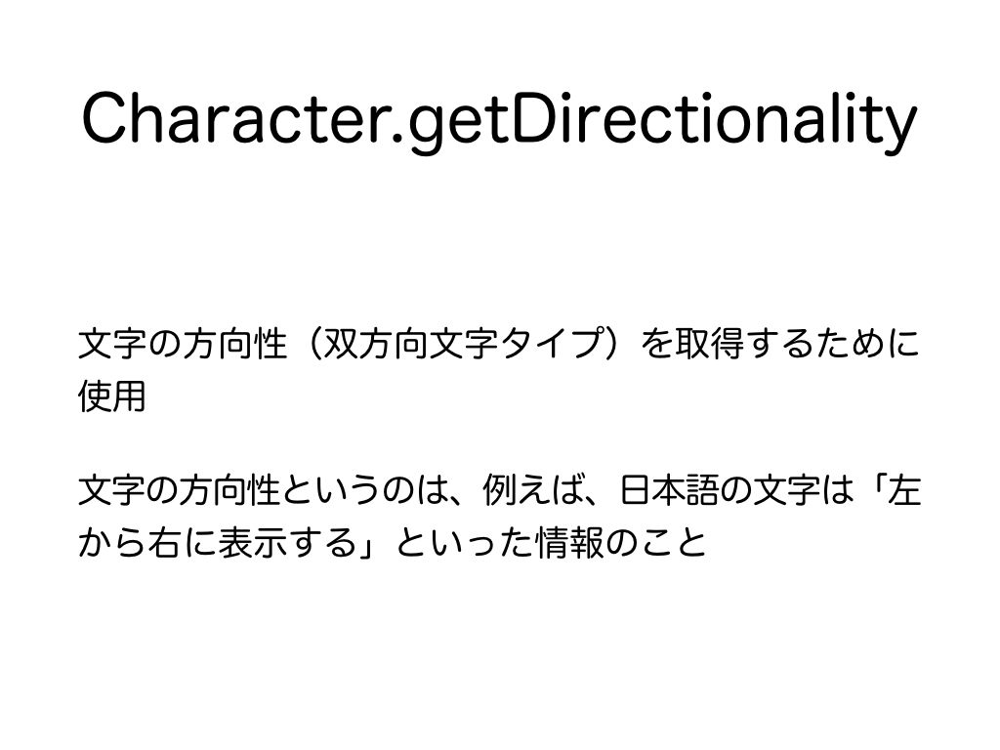<br>
Character.getDirectionalityは文字の方向性（双方向文字タイプ）を取得するために使用します。文字の方向性というのは、例えば、日本語の文字は「左から右に表示する」といった情報のことです。<br>
rf. <a href="http://unicode.org/reports/tr44/#Bidi_Class_Values" target="_blank">5.7.2 Bidirectional Class Values - Unicode® Standard Annex #44 UNICODE CHARACTER DATABASE</a>
<table>
<tr><th colspan="2">双方向文字タイプ</th><th>java.lang.Character</th></tr>
<tr><td>AN</td><td>弱い双方向文字タイプ</td><td>DIRECTIONALITY_ARABIC_NUMBER</td></tr>
<tr><td>BN</td><td>弱い双方向文字タイプ</td><td>DIRECTIONALITY_BOUNDARY_NEUTRAL</td></tr>
<tr><td>CS</td><td>弱い双方向文字タイプ</td><td>DIRECTIONALITY_COMMON_NUMBER_SEPARATOR</td></tr>
<tr><td>EN</td><td>弱い双方向文字タイプ</td><td>DIRECTIONALITY_EUROPEAN_NUMBER</td></tr>
<tr><td>ES</td><td>弱い双方向文字タイプ</td><td>DIRECTIONALITY_EUROPEAN_NUMBER_SEPARATOR</td></tr>
<tr><td>ET</td><td>弱い双方向文字タイプ</td><td>DIRECTIONALITY_EUROPEAN_NUMBER_TERMINATOR</td></tr>
<tr><td>L</td><td>強力な双方向文字タイプ</td><td>DIRECTIONALITY_LEFT_TO_RIGHT</td></tr>
<tr><td>LRE</td><td>強力な双方向文字タイプ（U+202A）</td><td>DIRECTIONALITY_LEFT_TO_RIGHT_EMBEDDING</td></tr>
<tr><td>LRO</td><td>強力な双方向文字タイプ（U+202D）</td><td>DIRECTIONALITY_LEFT_TO_RIGHT_OVERRIDE</td></tr>
<tr><td>NSM</td><td>弱い双方向文字タイプ</td><td>DIRECTIONALITY_NONSPACING_MARK</td></tr>
<tr><td>ON</td><td>ニュートラルな双方向文字タイプ</td><td>DIRECTIONALITY_OTHER_NEUTRALS</td></tr>
<tr><td>B</td><td>ニュートラルな双方向文字タイプ</td><td>DIRECTIONALITY_PARAGRAPH_SEPARATOR</td></tr>
<tr><td>PDF</td><td>弱い双方向文字タイプ（U+202C）</td><td>DIRECTIONALITY_POP_DIRECTIONAL_FORMAT</td></tr>
<tr><td>R</td><td>強力な双方向文字タイプ</td><td>DIRECTIONALITY_RIGHT_TO_LEFT</td></tr>
<tr><td>AL</td><td>強力な双方向文字タイプ</td><td>DIRECTIONALITY_RIGHT_TO_LEFT_ARABIC</td></tr>
<tr><td>RLE</td><td>強力な双方向文字タイプ（U+202B）</td><td>DIRECTIONALITY_RIGHT_TO_LEFT_EMBEDDING</td></tr>
<tr><td>RLO</td><td>強力な双方向文字タイプ（U+202E）</td><td>DIRECTIONALITY_RIGHT_TO_LEFT_OVERRIDE</td></tr>
<tr><td>S</td><td>ニュートラルな双方向文字タイプ</td><td>DIRECTIONALITY_SEGMENT_SEPARATOR</td></tr>
<tr><td>&nbsp;</td><td>未定義の双方向文字タイプ</td><td>DIRECTIONALITY_UNDEFINED</td></tr>
<tr><td>WS</td><td>ニュートラルな双方向文字タイプ</td><td>DIRECTIONALITY_WHITESPACE</td></tr>
</table>

```scala
  private val hiraganaChar: Char = 'か'
  private val katakanaChar: Char = 'カ'
  private val alphabetChar: Char = 'C'
  private val symbolChar:   Char = '+'

  private val hiraganaCodePoint: Int = Character.codePointAt(Array[Char](hiraganaChar), 0)
  private val katakanaCodePoint: Int = Character.codePointAt(Array[Char](katakanaChar), 0)
  private val alphabetCodePoint: Int = Character.codePointAt(Array[Char](alphabetChar), 0)
  private val symbolCodePoint:   Int = Character.codePointAt(Array[Char](symbolChar),   0)

  @Test
  def testCharacterDirectionality(): Unit = {
    //index order
    assert((-1: Byte) == Character.DIRECTIONALITY_UNDEFINED)
    assert(( 0: Byte) == Character.DIRECTIONALITY_LEFT_TO_RIGHT)
    assert(( 1: Byte) == Character.DIRECTIONALITY_RIGHT_TO_LEFT)
    assert(( 2: Byte) == Character.DIRECTIONALITY_RIGHT_TO_LEFT_ARABIC)
    assert(( 3: Byte) == Character.DIRECTIONALITY_EUROPEAN_NUMBER)
    assert(( 4: Byte) == Character.DIRECTIONALITY_EUROPEAN_NUMBER_SEPARATOR)
    assert(( 5: Byte) == Character.DIRECTIONALITY_EUROPEAN_NUMBER_TERMINATOR)
    assert(( 6: Byte) == Character.DIRECTIONALITY_ARABIC_NUMBER)
    assert(( 7: Byte) == Character.DIRECTIONALITY_COMMON_NUMBER_SEPARATOR)
    assert(( 8: Byte) == Character.DIRECTIONALITY_NONSPACING_MARK)
    assert(( 9: Byte) == Character.DIRECTIONALITY_BOUNDARY_NEUTRAL)
    assert((10: Byte) == Character.DIRECTIONALITY_PARAGRAPH_SEPARATOR)
    assert((11: Byte) == Character.DIRECTIONALITY_SEGMENT_SEPARATOR)
    assert((12: Byte) == Character.DIRECTIONALITY_WHITESPACE)
    assert((13: Byte) == Character.DIRECTIONALITY_OTHER_NEUTRALS)
    assert((14: Byte) == Character.DIRECTIONALITY_LEFT_TO_RIGHT_EMBEDDING)
    assert((15: Byte) == Character.DIRECTIONALITY_LEFT_TO_RIGHT_OVERRIDE)
    assert((16: Byte) == Character.DIRECTIONALITY_RIGHT_TO_LEFT_EMBEDDING)
    assert((17: Byte) == Character.DIRECTIONALITY_RIGHT_TO_LEFT_OVERRIDE)
    assert((18: Byte) == Character.DIRECTIONALITY_POP_DIRECTIONAL_FORMAT)

    //alphabetical order
    assert(( 6: Byte) == Character.DIRECTIONALITY_ARABIC_NUMBER)
    assert(( 9: Byte) == Character.DIRECTIONALITY_BOUNDARY_NEUTRAL)
    assert(( 7: Byte) == Character.DIRECTIONALITY_COMMON_NUMBER_SEPARATOR)
    assert(( 3: Byte) == Character.DIRECTIONALITY_EUROPEAN_NUMBER)
    assert(( 4: Byte) == Character.DIRECTIONALITY_EUROPEAN_NUMBER_SEPARATOR)
    assert(( 5: Byte) == Character.DIRECTIONALITY_EUROPEAN_NUMBER_TERMINATOR)
    assert(( 0: Byte) == Character.DIRECTIONALITY_LEFT_TO_RIGHT)
    assert((14: Byte) == Character.DIRECTIONALITY_LEFT_TO_RIGHT_EMBEDDING)
    assert((15: Byte) == Character.DIRECTIONALITY_LEFT_TO_RIGHT_OVERRIDE)
    assert(( 8: Byte) == Character.DIRECTIONALITY_NONSPACING_MARK)
    assert((13: Byte) == Character.DIRECTIONALITY_OTHER_NEUTRALS)
    assert((10: Byte) == Character.DIRECTIONALITY_PARAGRAPH_SEPARATOR)
    assert((18: Byte) == Character.DIRECTIONALITY_POP_DIRECTIONAL_FORMAT)
    assert(( 1: Byte) == Character.DIRECTIONALITY_RIGHT_TO_LEFT)
    assert(( 2: Byte) == Character.DIRECTIONALITY_RIGHT_TO_LEFT_ARABIC)
    assert((16: Byte) == Character.DIRECTIONALITY_RIGHT_TO_LEFT_EMBEDDING)
    assert((17: Byte) == Character.DIRECTIONALITY_RIGHT_TO_LEFT_OVERRIDE)
    assert((11: Byte) == Character.DIRECTIONALITY_SEGMENT_SEPARATOR)
    assert((-1: Byte) == Character.DIRECTIONALITY_UNDEFINED)
    assert((12: Byte) == Character.DIRECTIONALITY_WHITESPACE)

    //Char
    assert(Character.getDirectionality(hiraganaChar) == Character.DIRECTIONALITY_LEFT_TO_RIGHT)
    assert(Character.getDirectionality(katakanaChar) == Character.DIRECTIONALITY_LEFT_TO_RIGHT)
    assert(Character.getDirectionality(alphabetChar) == Character.DIRECTIONALITY_LEFT_TO_RIGHT)
    assert(Character.getDirectionality(symbolChar)   == Character.DIRECTIONALITY_EUROPEAN_NUMBER_SEPARATOR)

    //コードポイント
    assert(Character.getDirectionality(hiraganaCodePoint) == Character.DIRECTIONALITY_LEFT_TO_RIGHT)
    assert(Character.getDirectionality(katakanaCodePoint) == Character.DIRECTIONALITY_LEFT_TO_RIGHT)
    assert(Character.getDirectionality(alphabetCodePoint) == Character.DIRECTIONALITY_LEFT_TO_RIGHT)
    assert(Character.getDirectionality(symbolCodePoint)   == Character.DIRECTIONALITY_EUROPEAN_NUMBER_SEPARATOR)
  }
```

***
<h3>1.3　java.lang.Characterクラスによる文字の字種判定</h3>
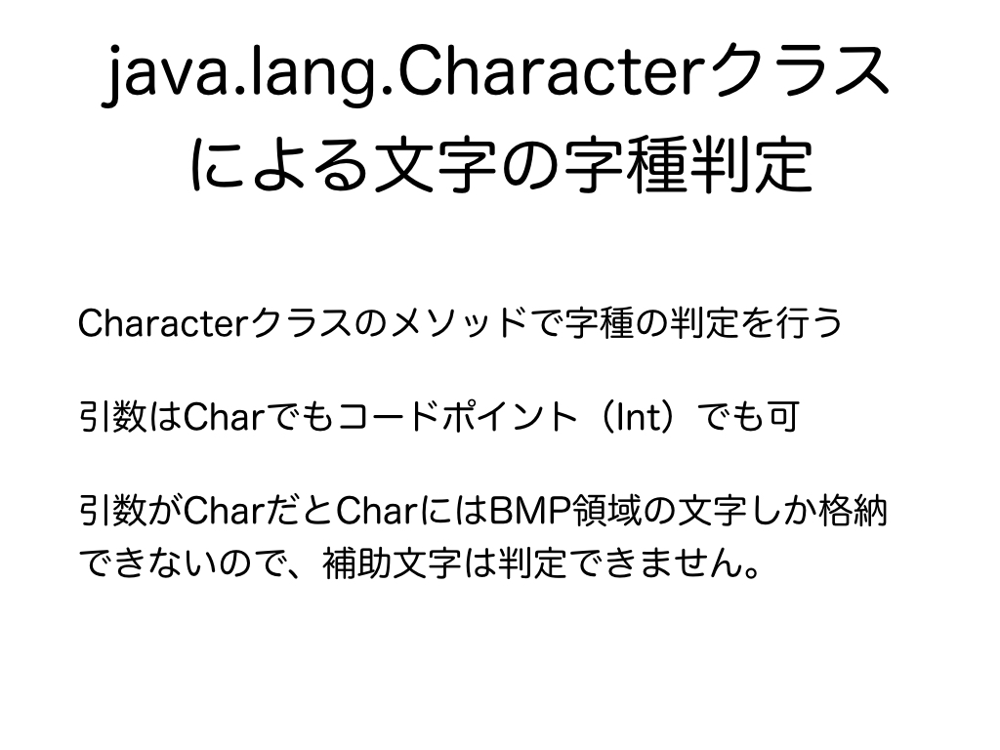<br>
Characterクラスのメソッドで字種の判定を行います。引数はCharでもコードポイント（Int）でも可です。ただし引数がCharだとCharにはBMP領域の文字しか格納できないので、補助文字は判定できません。
<table>
<tr><th>java.lang.Characterの字種判定メソッド</th><th>説明</th></tr>
<tr><td>isDefined</td><td>Unicodeで定義されている。</td></tr>
<tr><td>isDigit</td><td><strong>半角数字・全角数字など</strong>の数字である。<br><strong>「〇」以外の漢数字は数字として判定されない。</strong><br>（Character.getType(codePoint)がDECIMAL_DIGIT_NUMBERである。）</td></tr>
<tr><td>isLetter</td><td>汎用文字である。<br>（Character.getType(codePoint)がUPPERCASE_LETER, LOWERCASE_LETTER, TITLECASE_LETTER, MODIFIER_LETTER, OTHER_LETTERのいずれかである。）</td></tr>
<tr><td>isLetterOrDigit</td><td>Character.isLetterまたはCharacter.isDigit</td></tr>
<tr><td>isLowerCase</td><td>小文字である。Character.getType(codePoint)がLOWERCASE_LETTERであるか、Unicode標準で規定された寄与プロパティOther_Lowercaseを持つ。</td></tr>
<tr><td>isTitleCase</td><td>タイトルケース文字である。Character.getType(codePoint)がTITLECASE_LETTERである。</td></tr>
<tr><td>isUpperCase</td><td>大文字である。Character.getType(codePoint)がUPPERCASE_LETTERであるか、Unicode標準で規定された寄与プロパティOther_Uppercaseを持つ。</td></tr>
<tr><td>isSpaceChar</td><td>Unicode標準の空白文字である。Character.getType(codePoint)がSPACE_SEPARATOR, LINE_SEPARATOR, PARAGRAPH_SEPARATORのいずれかである。</td></tr>
<tr><td>isWhiteSpace</td><td>空白文字である。次のいずれかを満たす場合、空白文字とみなされます。
<ul>
<li>Unicode の空白文字 (SPACE_SEPARATOR、LINE_SEPARATOR、または PARAGRAPH_SEPARATOR) であるが、改行なしの空白 ('\u00A0'、'\u2007'、'\u202F') ではない。</li>
<li>'\t' (U+0009 水平タブ) である</li>
<li>'\n' (U+000A 改行) である。</li>
<li>'\u000B' (U+000B 垂直タブ) である</li>
<li>'\f' (U+000C フォームフィード) である。</li>
<li>'\r' (U+000D 復帰) である。</li>
<li>'\u001C' (U+001C ファイル区切り文字) である。</li>
<li>'\u001D' (U+001D グループ区切り文字) である。</li>
<li>'\u001E' (U+001E レコード区切り文字) である。</li>
<li>'\u001F' (U+001F 単位区切り文字) である。</li>
</ul>
</td></tr>
<tr><td>isMirrored</td><td>Unicode 仕様に従って、指定された文字 (Unicode コードポイント) をミラー化するかどうかを判定します。テキスト内で右から左に文字が描画される場合、文字のミラー化により、グリフが水平方向にミラー化されます。たとえば、'\u0028' LEFT PARENTHESIS は、セマンティクスでは開き括弧として定義されています。これは、左から右に描画されるテキストでは「(」になり、右から左に描画されるテキストでは「)」になります。</td></tr>
<tr><td>isISOControl</td><td>参照された文字 (Unicode コードポイント) が ISO 制御文字かどうかを判定します。コードが '\u0000' - '\u001F' の範囲、または '\u007F' - '\u009F' の範囲の場合は、ISO 制御文字と見なされます。</td></tr>
<tr><td>isIdentifierIgnorable</td><td>指定された文字 (Unicode コードポイント) が、Java 識別子または Unicode 識別子内で無視可能な文字かどうかを判定します。次の Unicode 文字は、Java 識別子や Unicode 識別子内で無視できます。
<ul><li>空白以外の ISO 制御文字
<ul>
<li>'\u0000' - '\u0008'</li>
<li>'\u000E' - '\u001B'</li>
<li>'\u007F' - '\u009F'</li>
</ul></li>
<li>Character.getType(codePoint)がFORMATであるすべての文字</li>
</ul>
</td></tr>
<tr><td>isUnicodeIdentifierStart</td><td>指定された文字 (Unicode コードポイント) を Unicode 識別子の最初の文字として指定可能かどうかを判定します。次の条件のどれかに当てはまる場合にだけ、その文字を Unicode 識別子の最初に指定できます。
<ul>
<li>Character.isLetter(codePoint) が true を返す。</li>
<li>Character.getType(codePoint) が LETTER_NUMBER を返す。</li>
</ul>
</td></tr>
<tr><td>isUnicodeIdentifierPart</td><td>指定された文字 (Unicode コードポイント) を Unicode 識別子の最初の文字以外に使用可能かどうかを判定します。次の文のどれかに当てはまる場合にだけ、その文字を Unicode 識別子の一部に使用できます。
<ul>
<li>汎用文字である</li>
<li>連結句読点文字である ('_' など)</li>
<li>数字である</li>
<li>数値汎用文字である (ローマ数字文字など)</li>
<li>連結マークである</li>
<li>非スペーシングマークである</li>
<li>この文字の Character.isIdentifierIgnorable が true を返す。</li>
</ul>
</td></tr>
<tr><td>isJavaIdentifierStart</td><td>
文字 (Unicode コードポイント) を Java 識別子の最初の文字として指定可能かどうかを判定します。次の条件のどれかに当てはまる場合にだけ、その文字を Java 識別子の最初に指定できます。
<ul>
<li>Character.isLetter(codePoint) が次を返す: true</li>
<li>Character.getType(codePoint) が次を返す: LETTER_NUMBER</li>
<li><u>参照される文字が通貨記号である ('$' など)</u></li>
<li><u>参照文字が連結句読点文字である ('_' など)</u></li>
</ul>
</td></tr>
<tr><td>isJavaIdentifierPart</td><td>文字 (Unicode コードポイント) を Java 識別子の最初の文字以外に使用可能かどうかを判定します。次のどれかに当てはまる場合にだけ、その文字を Java 識別子の一部に指定できます。
<ul>
<li>汎用文字である</li>
<li><u>通貨記号である ('$' など)</u></li>
<li>連結句読点文字である ('_' など)</li>
<li>数字である</li>
<li>数値汎用文字である (ローマ数字文字など)</li>
<li>連結マークである</li>
<li>非スペーシングマークである</li>
<li>文字の Character.isIdentifierIgnorable(codePoint) が true を返す。</li>
</ul>
</td></tr>
</table>
***
<h3>1.4　正規表現の字種によるマッチング</h3>
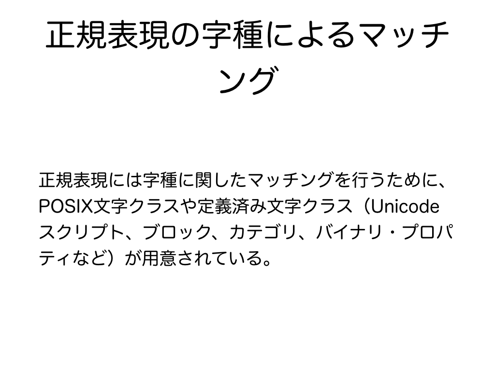<br>
正規表現には字種に関したマッチングを行うために、POSIX文字クラスや定義済み文字クラス（Unicodeスクリプト、ブロック、カテゴリ、バイナリ・プロパティなど）が用意されています。
<h4>1.4.1　POSIX文字クラス(US-ASCIIのみ)</h4>
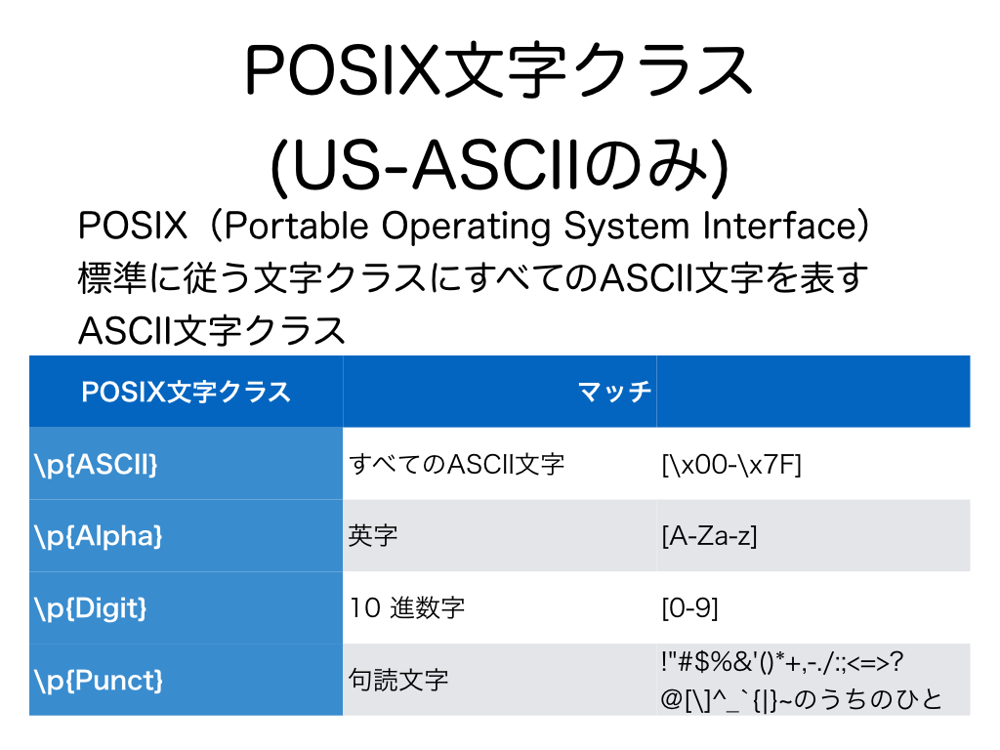<br>
POSIX（Portable Operating System Interface）標準に従う文字クラスにすべてのASCII文字を表すASCII文字クラスが追加されています。<br>
rf. <a href="http://pubs.opengroup.org/onlinepubs/9699919799/basedefs/V1_chap09.html" target="_blank">9.3.5 RE Bracket Expression - The Open Group Base Specifications Issue 7 IEEE Std 1003.1™, 2013 Edition</a>
<table>
<tr><th>クラス</th><th colspan="2">マッチ</th></tr>
<tr><td>\p{Lower}</td><td>小文字の英字</td><td>[a-z]</td></tr>
<tr><td>\p{Upper}</td><td>大文字の英字</td><td>[A-Z]</td></tr>
<tr><td>\p{ASCII}</td><td>すべてのASCII文字</td><td>[\x00-\x7F]</td></tr>
<tr><td>\p{Alpha}</td><td>英字</td><td>[\p{Lower}\p{Upper}]</td></tr>
<tr><td>\p{Digit}</td><td>10 進数字</td><td>[0-9]</td></tr>
<tr><td>\p{Alnum}</td><td>英数字</td><td>[\p{Alpha}\p{Digit}]</td></tr>
<tr><td>\p{Punct}</td><td>句読文字</td><td>!"#$%&amp;'()*+,-./:;&lt;=&gt;?@[\]^_`{|}~のうちのひとつ</td></tr>
<tr><td>\p{Graph}</td><td>表示できる文字</td><td>[\p{Alnum}\p{Punct}]</td></tr>
<tr><td>\p{Print}</td><td>プリント可能文字</td><td>[\p{Graph}\x20]</td></tr>
<tr><td>\p{Blank}</td><td>空白またはタブ</td><td>[\t]</td></tr>
<tr><td>\p{Cntrl}</td><td>制御文字</td><td>[\x00-\x1F\x7F]</td></tr>
<tr><td>\p{XDigit}</td><td>16進数字</td><td>[0-9a-fA-F]</td></tr>
<tr><td>\p{Space}</td><td>空白文字</td><td>[\t\n\x0B\f\r]</td></tr>
</table>
***
<h4>1.4.2　java.lang.Characterクラス(単純なJava文字タイプ)</h4>
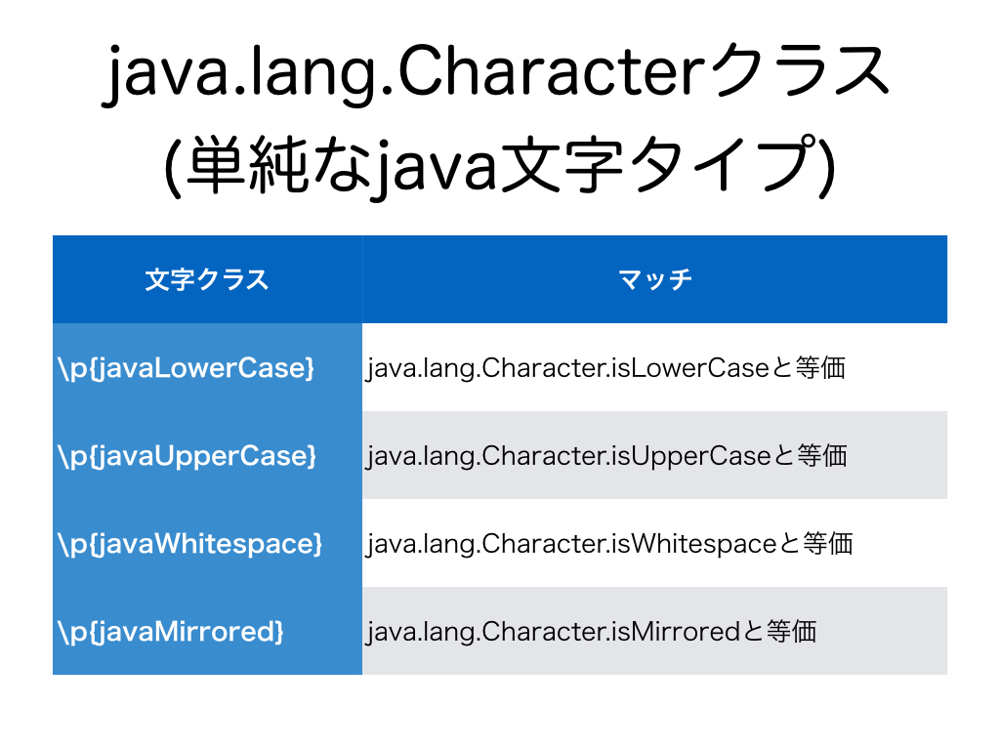<br>
<table>
<tr><th>クラス</th><th>マッチ</th></tr>
<tr><td>\p{javaLowerCase}</td><td>java.lang.Character.isLowerCase()と等価</td></tr>
<tr><td>\p{javaUpperCase}</td><td>java.lang.Character.isUpperCase()と等価</td></tr>
<tr><td>\p{javaWhitespace}</td><td>java.lang.Character.isWhitespace()と等価</td></tr>
<tr><td>\p{javaMirrored}</td><td>java.lang.Character.isMirrored()と等価</td></tr>
</table>
***
<h4>1.4.3　Unicodeスクリプト、ブロック、カテゴリ、バイナリ・プロパティのクラス</h4>
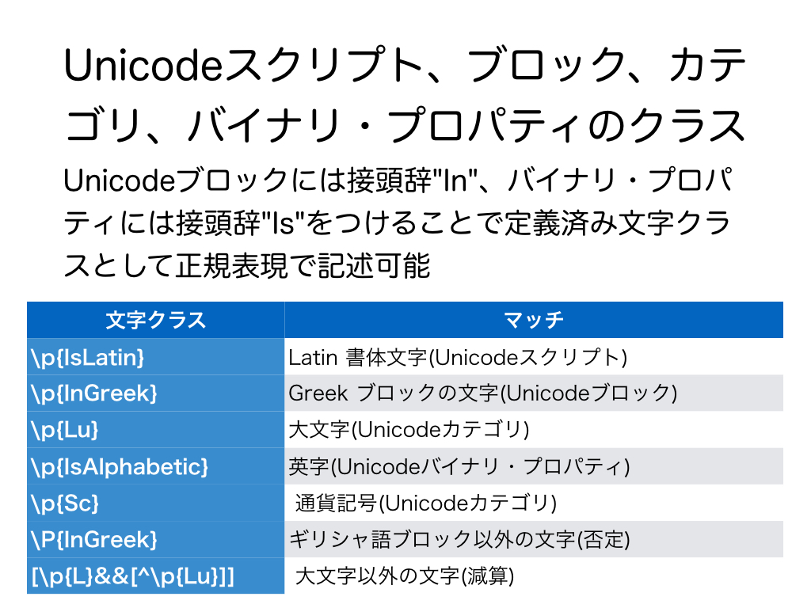<br>
Unicodeブロックには接頭辞"In"、バイナリ・プロパティには接頭辞"Is"をつけることで定義済み文字クラスとして正規表現で記述できます。
<table>
<tr><th>クラス</th><th>マッチ</th></tr>
<tr><td>\p{IsLatin}</td><td>Latin 書体文字(スクリプト)</td></tr>
<tr><td>\p{InGreek}</td><td>Greek ブロックの文字(ブロック)</td></tr>
<tr><td>\p{Lu}</td><td>大文字(カテゴリ)</td></tr>
<tr><td>\p{IsAlphabetic}</td><td>英字(バイナリ・プロパティ)</td></tr>
<tr><td>\p{Sc}</td><td>通貨記号(カテゴリ)</td></tr>
<tr><td>\P{InGreek}</td><td>ギリシャ語ブロック以外の文字(否定)</td></tr>
<tr><td>[\p{L}&&[^\p{Lu}]]</td><td>大文字以外の文字(減算)</td></tr>
</table>
***
<h4>1.4.4　POSIX文字クラスと定義済の文字クラスの互換性</h4>
<br>
POSIX文字クラスと定義済の文字クラスは、<a href="https://docs.oracle.com/javase/jp/8/docs/api/java/util/regex/Pattern.html#UNICODE_CHARACTER_CLASS" target="_blank">UNICODE_CHARACTER_CLASS</a>フラグが指定されている場合、<a href="http://www.unicode.org/reports/tr18/" target="_blank">Unicode正規表現</a>の付録C: 互換性プロパティの勧告に適合しています。
<table>
<tr><th>クラス</th><th colspan="2">マッチ</th></tr>
<tr><td>\p{Lower}</td><td>小文字</td><td>\p{IsLowercase}</td></tr>
<tr><td>\p{Upper}</td><td>大文字</td><td>\p{IsUppercase}</td></tr>
<tr><td>\p{ASCII}</td><td>すべてのASCII文字</td><td>[\x00-\x7F]</td></tr>
<tr><td>\p{Alpha}</td><td>英字</td><td>\p{IsAlphabetic}</td></tr>
<tr><td>\p{Digit}</td><td>10進数字</td><td>\p{IsDigit}</td></tr>
<tr><td>\p{Alnum}</td><td>英数字</td><td>[\p{IsAlphabetic}\p{IsDigit}]</td></tr>
<tr><td>\p{Punct}</td><td>句読点文字</td><td>\p{IsPunctuation}</td></tr>
<tr><td>\p{Graph}</td><td>表示できる文字</td><td>[^\p{IsWhite_Space}\p{gc=Cc}\p{gc=Cs}\p{gc=Cn}]</td></tr>
<tr><td>\p{Print}</td><td>プリント可能文字</td><td>[\p{Graph}\p{Blank}&&[^\p{Cntrl}]]</td></tr>
<tr><td>\p{Blank}</td><td>空白またはタブ</td><td>[\p{IsWhite_Space}&&[^\p{gc=Zl}\p{gc=Zp}\x0a\x0b\x0c\x0d\x85]]</td></tr>
<tr><td>\p{Cntrl}</td><td>制御文字</td><td>\p{gc=Cc}</td></tr>
<tr><td>\p{XDigit}</td><td>16進数字</td><td>[\p{gc=Nd}\p{IsHex_Digit}]</td></tr>
<tr><td>\p{Space}</td><td>空白文字</td><td>\p{IsWhite_Space}</td></tr>
<tr><td>\d</td><td>数字</td><td>\p{IsDigit}</td></tr>
<tr><td>\D</td><td>数字以外</td><td>[^\d]</td></tr>
<tr><td>\s</td><td>空白文字</td><td>\p{IsWhite_Space}</td></tr>
<tr><td>\S</td><td>非空白文字</td><td>[^\s]</td></tr>
<tr><td>\w</td><td>単語構成文字</td><td>[\p{Alpha}\p{gc=Mn}\p{gc=Me}\p{gc=Mc}\p{Digit}\p{gc=Pc}\p{IsJoin_Control}]</td></tr>
<tr><td>\W</td><td>非単語文字</td><td>[^\w]</td></tr>
</table>
***
<h4>1.4.5　日本語の字種のマッチング</h4>
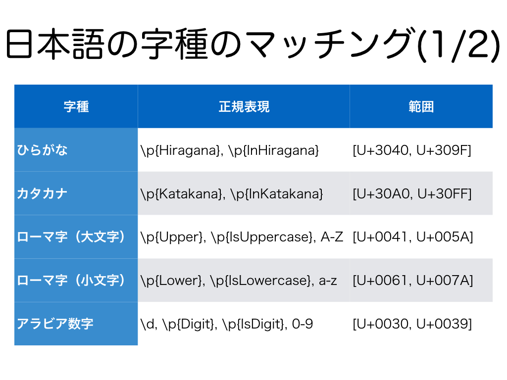<br>
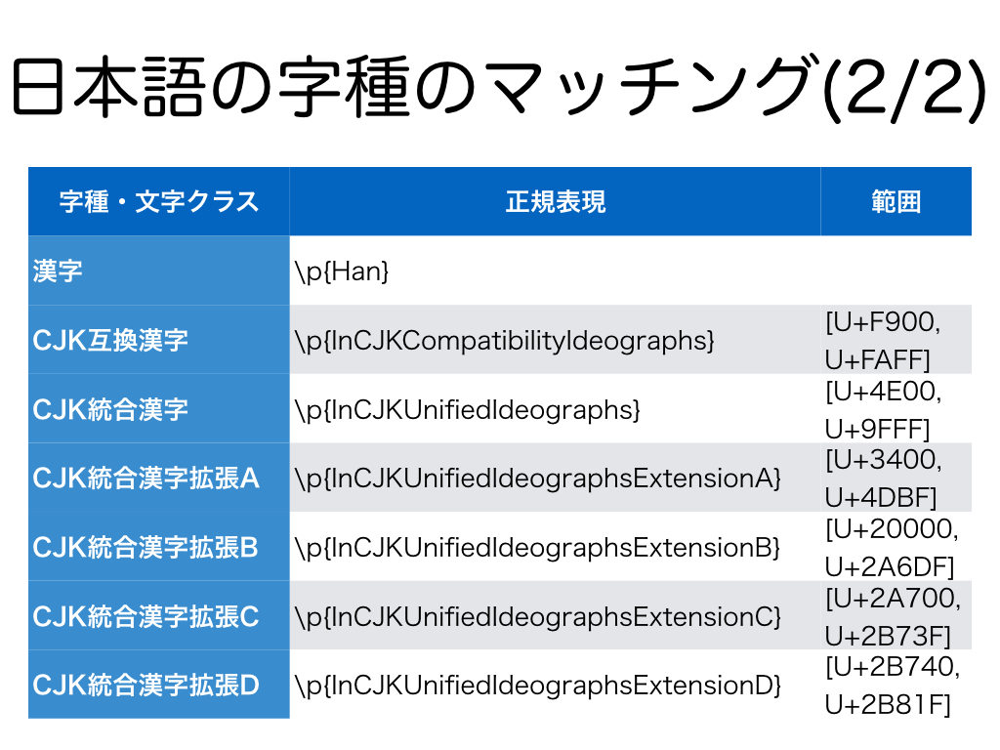<br>
ひらがな
<table>
<tr><th>正規表現</th><th>説明</th><th>範囲</th></tr>
<tr><td>\p{Hiragana}</td><td>ひらがな（Unicodeスクリプト）</td><td>[U+3040, U+309F]</td></tr>
<tr><td>\p{InHiragana}</td><td>ひらがな（Unicodeブロック）</td><td>[U+3040, U+309F]</td></tr>
<tr><td>\p{InKanaSupplement}</td><td>歴史的仮名（衣と江の仮名文字が0x1B000と0x1B001に対応）（Unicodeブロック）</td><td>[U+1B000, U+1B0FF]</td></tr>
</table>

カタカナ
<table>
<tr><th>正規表現</th><th>説明</th><th>範囲</th></tr>
<tr><td>\p{Katakana}</td><td>カタカナ（Unicodeスクリプト）</td><td>[U+30A0, U+30FF]</td></tr>
<tr><td>\p{InKatakana}</td><td>カタカナ（Unicodeブロック）</td><td>[U+30A0, U+30FF]</td></tr>
<tr><td>\p{InKatakanaPhoneticExtensions}</td><td>アイヌ語などの翻字に使用する小書カタカナ（Unicodeブロック）</td><td>[U+31F0, U+31FF]</td></tr>
</table>

ローマ字
<table>
<tr><th>正規表現</th><th>説明</th><th>範囲</th></tr>
<tr><td>\p{Upper}</td><td>大文字（POSIX文字クラス）</td><td>[U+0041, U+005A]</td></tr>
<tr><td>\p{IsUppercase}</td><td>大文字（Unicodeスクリプト）</td><td>[U+0041, U+005A]</td></tr>
<tr><td>A-Z</td><td>大文字</td><td>[U+0041, U+005A]</td></tr>
<tr><td>\p{Lower}</td><td>小文字（POSIX文字クラス）</td><td>[U+0061, U+007A]</td></tr>
<tr><td>\p{IsLowercase}</td><td>小文字（Unicodeスクリプト）</td><td>[U+0061, U+007A]</td></tr>
<tr><td>a-z</td><td>小文字</td><td>[U+0061, U+007A]</td></tr>
</table>

アラビア数字
<table>
<tr><th>正規表現</th><th>説明</th><th>範囲</th></tr>
<tr><td>\d</td><td>10進数字</td><td>[U+0030, U+0039]</td></tr>
<tr><td>\p{Digit}</td><td>10進数字（POSIX文字クラス）</td><td>[U+0030, U+0039]</td></tr>
<tr><td>\p{IsDigit}</td><td>10進数字（Unicodeスクリプト）</td><td>[U+0030, U+0039]</td></tr>
<tr><td>0-9</td><td>10進数字</td><td>[U+0030, U+0039]</td></tr>
</table>

漢字
<table>
<tr><th>正規表現</th><th>説明</th><th>範囲</th></tr>
<tr><td>\p{Han}</td><td>漢字（Unicodeスクリプト）</td><td>&nbsp;</td></tr>
<tr><td>\p{InCJKCompatibilityIdeographs}</td><td>CJK互換漢字（Unicodeブロック）</td><td>[U+F900, U+FAFF]</td></tr>
<tr><td>\p{InCJKCompatibilityIdeographs Supplement}</td><td>CJK互換漢字補助（Unicodeブロック）</td><td>[U+2F800, U+2FA1D]</td></tr>
<tr><td>\p{InCJKRadicalsSupplement}</td><td>CJK部首補助（Unicodeブロック）</td><td>[U+2E80, U+2EFF]</td></tr>
<tr><td>\p{InCJKStrokes}</td><td>CJKの筆画（Unicodeブロック）</td><td>[U+31C0, U+31EF]</td></tr>
<tr><td>\p{InCJKSymbolsAndPunctuation}</td><td>CJK記号と句読点（Unicodeブロック）</td><td>[U+3000, U+303F]</td></tr>
<tr><td>\p{InCJKUnifiedIdeographs}</td><td>CJK統合漢字（Unicodeブロック）</td><td>[U+4E00, U+9FFF]</td></tr>
<tr><td>\p{InCJKUnifiedIdeographsExtensionA}</td><td>CJK統合漢字拡張A（Unicodeブロック）</td><td>[U+3400, U+4DBF]</td></tr>
<tr><td>\p{InCJKUnifiedIdeographsExtensionB}</td><td>CJK統合漢字拡張B（Unicodeブロック）</td><td>[U+20000, U+2A6DF]</td></tr>
<tr><td>\p{InCJKUnifiedIdeographsExtensionC}</td><td>CJK統合漢字拡張C（Unicodeブロック）</td><td>[U+2A700, U+2B73F]</td></tr>
<tr><td>\p{InCJKUnifiedIdeographsExtensionD}</td><td>CJK統合漢字拡張D（Unicodeブロック）</td><td>[U+2B740, U+2B81F]</td></tr>
<tr><td>\p{InIdeographicDescriptionCharacters}</td><td>漢字構成記述文字（Unicodeブロック）</td><td>[U+2FF0, U+2FFF]</td></tr>
<tr><td>\p{InKanbun}</td><td>漢文の返り点（Unicodeブロック）</td><td>[U+3190, U+319F]</td></tr>
<tr><td>\uFA0E-\uFA2D</td><td>カナダ漢字（IBM拡張文字）</td><td>[U+FA0E, U+FA2D]</td></tr>
<tr><td>\uFA2E\uFA2F</td><td>これらの字と0x9FCCはUnicode6.1から追加</td><td>[U+FA2E, U+FA2F]</td></tr>
<tr><td>\uFA30-\uFA6A</td><td>康煕別掲字（こうきべっけいじ）・人名許容体</td><td>[U+FA30, U+FA6A]</td></tr>
<tr><td>\uFA6B-\uFA6D</td><td>ARIB外字（日本のデータ放送用）</td><td>[U+FA6B, U+FA6D]</td></tr>
</table>
***
<h4>1.4.6　主に日本語フォントで用いられる漢字の定義とマッチング（自作）</h4>
<table>
<tr>
<th>変数・メソッド</th><th>説明</th>
</tr>
<tr>
<td>regex</td><td>正規表現を返す。</td>
</tr>
<tr>
<td>pattern</td><td>Patternクラスを返す。</td>
</tr>
<tr>
<td>isDefined</td><td>文字（Charかコードポイント）を与えると漢字として定義されているかを返す。</td>
</tr>
<tr>
<td>notDefined</td><td>isDefinedの否定を返す。</td>
</tr>
</table>
<table>
<tr>
<th>漢字集合</th><th>クラス</th><th>データ</th>
</tr>
<tr>
<td>常用漢字</td><td><a href="https://github.com/ynupc/scalastringcourseday7/blob/master/src/main/scala/text/kanji/JoyoKanjiCharacter.scala">JoyoKanjiCharacter.scala</a></td><td><a href="https://github.com/ynupc/scalastringcourseday7/blob/master/src/main/resources/kanji/joyo_kanji.csv">joyo_kanji.csv</a></td>
</tr>
<tr>
<td>教育漢字（小学１〜６年生）</td><td><a href="https://github.com/ynupc/scalastringcourseday7/blob/master/src/main/scala/text/kanji/PrimarySchoolKanjiCharacter.scala">PrimarySchoolKanjiCharacter.scala</a></td><td>&nbsp;</td>
</tr>
<tr>
<td>教育漢字（小学１年生）</td><td><a href="https://github.com/ynupc/scalastringcourseday7/blob/master/src/main/scala/text/kanji/PrimarySchool1stGradeKanjiCharacter.scala">PrimarySchool1stGradeKanjiCharacter.scala</a></td><td><a href="https://github.com/ynupc/scalastringcourseday7/blob/master/src/main/resources/kanji/primary_school_1st_grade.csv">primary_school_1st_grade.csv</a></td>
</tr>
<tr>
<td>教育漢字（小学２年生）</td><td><a href="https://github.com/ynupc/scalastringcourseday7/blob/master/src/main/scala/text/kanji/PrimarySchool2ndGradeKanjiCharacter.scala">PrimarySchool2ndGradeKanjiCharacter.scala</a></td><td><a href="https://github.com/ynupc/scalastringcourseday7/blob/master/src/main/resources/kanji/primary_school_2nd_grade.csv">primary_school_2nd_grade.csv</a></td>
</tr>
<tr>
<td>教育漢字（小学３年生）</td><td><a href="https://github.com/ynupc/scalastringcourseday7/blob/master/src/main/scala/text/kanji/PrimarySchool3rdGradeKanjiCharacter.scala">PrimarySchool3rdGradeKanjiCharacter.scala</a></td><td><a href="https://github.com/ynupc/scalastringcourseday7/blob/master/src/main/resources/kanji/primary_school_3rd_grade.csv">primary_school_3rd_grade.csv</a></td>
</tr>
<tr>
<td>教育漢字（小学４年生）</td><td><a href="https://github.com/ynupc/scalastringcourseday7/blob/master/src/main/scala/text/kanji/PrimarySchool4thGradeKanjiCharacter.scala">PrimarySchool4thGradeKanjiCharacter.scala</a></td><td><a href="https://github.com/ynupc/scalastringcourseday7/blob/master/src/main/resources/kanji/primary_school_4th_grade.csv">primary_school_4th_grade.csv</a></td>
</tr>
<tr>
<td>教育漢字（小学５年生）</td><td><a href="https://github.com/ynupc/scalastringcourseday7/blob/master/src/main/scala/text/kanji/PrimarySchool5thGradeKanjiCharacter.scala">PrimarySchool5thGradeKanjiCharacter.scala</a></td><td><a href="https://github.com/ynupc/scalastringcourseday7/blob/master/src/main/resources/kanji/primary_school_5th_grade.csv">primary_school_5th_grade.csv</a></td>
</tr>
<tr>
<td>教育漢字（小学６年生）</td><td><a href="https://github.com/ynupc/scalastringcourseday7/blob/master/src/main/scala/text/kanji/PrimarySchool6thGradeKanjiCharacter.scala">PrimarySchool6thGradeKanjiCharacter.scala</a></td><td><a href="https://github.com/ynupc/scalastringcourseday7/blob/master/src/main/resources/kanji/primary_school_6th_grade.csv">primary_school_6th_grade.csv</a></td>
</tr>
<tr>
<td>JIS第一水準</td><td><a href="https://github.com/ynupc/scalastringcourseday7/blob/master/src/main/scala/text/kanji/JISLevel1KanjiCharacter.scala">JISLevel1KanjiCharacter.scala</a></td><td><a href="https://github.com/ynupc/scalastringcourseday7/blob/master/src/main/resources/kanji/jis_level_1.csv">jis_level_1.csv</a></td>
</tr>
<tr>
<td>JIS第二水準</td><td><a href="https://github.com/ynupc/scalastringcourseday7/blob/master/src/main/scala/text/kanji/JISLevel2KanjiCharacter.scala">JISLevel2KanjiCharacter.scala</a></td><td><a href="https://github.com/ynupc/scalastringcourseday7/blob/master/src/main/resources/kanji/jis_level_2.csv">jis_level_2.csv</a></td>
</tr>
<tr>
<td>JIS第一・二水準</td><td><a href="https://github.com/ynupc/scalastringcourseday7/blob/master/src/main/scala/text/kanji/JISLevel1Plus2KanjiCharacter.scala">JISLevel1Plus2KanjiCharacter.scala</a></td><td>&nbsp;</td>
</tr>
<tr>
<td>JIS第三水準</td><td>未実装</td><td><a href="https://github.com/ynupc/scalastringcourseday7/blob/master/src/main/resources/kanji/jis_level_3.csv">jis_level_3.csv</a></td>
</tr>
<tr>
<td>JIS第一・二・三水準</td><td>未実装</td><td>&nbsp;</td>
</tr>
<tr>
<td>JIS第四水準</td><td>未実装</td><td><a href="https://github.com/ynupc/scalastringcourseday7/blob/master/src/main/resources/kanji/jis_level_4.csv">jis_level_4.csv</a></td>
</tr>
<tr>
<td>JIS第一・二・三・四水準</td><td>未実装</td><td>&nbsp;</td>
</tr>
<tr>
<td>人名用漢字</td><td>未実装</td><td>未実装</td>
</tr>
</table>
```scala
  @Test
  def testKanji(): Unit = {
    assert(JISLevel1Plus2KanjiCharacter.isDefined(kanjiChar))
    assert(JISLevel1Plus2KanjiCharacter.isDefined(Character.codePointAt(kanjiChar.toString, 0)))
  }
```
***
<h3>1.5　字種の変換</h3>
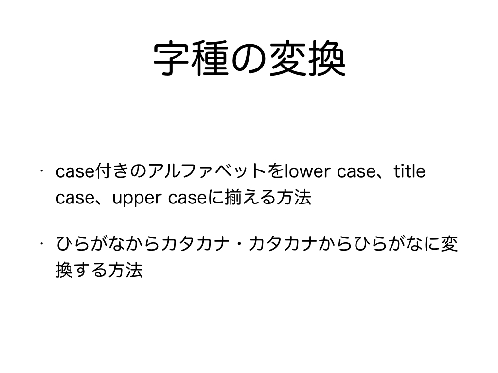<br>
case付きのアルファベットをlower case、title case、upper caseに揃える方法と、ひらがなからカタカナ・カタカナからひらがなに変換する方法について説明します。
<h4>1.5.1　letter case</h4>
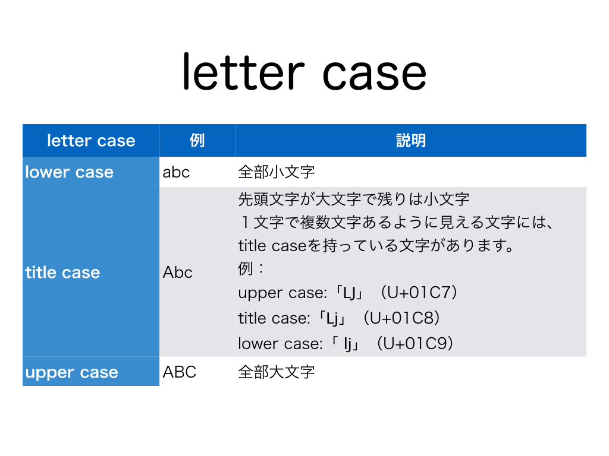<br>
letter caseにはlower case、title case、upper caseが存在します。
<table>
<tr><th>letter case</th><th>例</th><th>説明</th></tr>
<tr><td>lower case</td><td>abc</td><td>全部小文字</td></tr>
<tr><td>title case</td><td>Abc</td><td>先頭文字が大文字で残りは小文字<br>１文字で複数文字あるように見える文字には、<br>title caseを持っている文字があります。<br>例：<ul><li>upper case:「LJ」（U+01C7）</li><li>title case:「Lj」（U+01C8）</li><li>lower case:「	lj」（U+01C9）</li></ul></td></tr>
<tr><td>upper case</td><td>ABC</td><td>全部大文字</td></tr>
</table>
***
<h4>1.5.2　文字のletter caseの変換</h4>
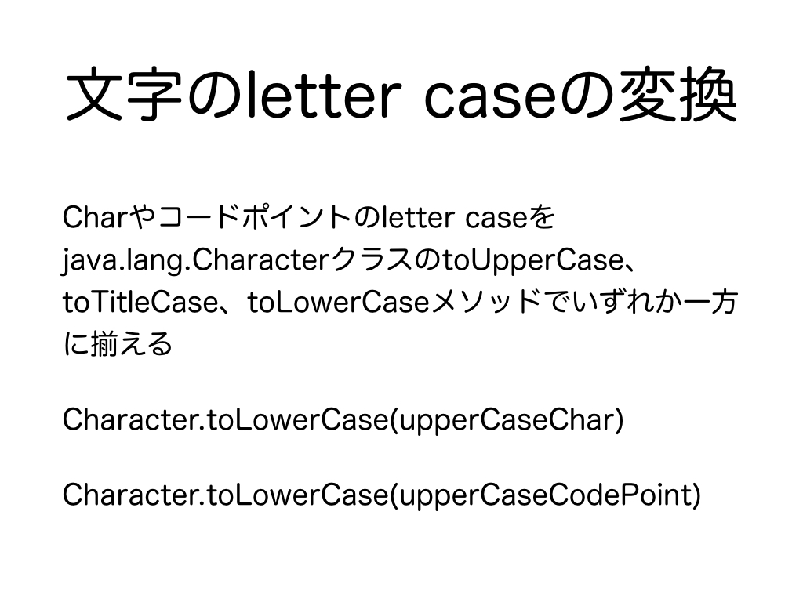<br>
Charやコードポイントのletter caseをjava.lang.CharacterクラスのtoUpperCase、toTitleCase、toLowerCaseメソッドでいずれか一方に揃えます。
```scala
  private val upperCaseChar: Char = '\u01C7'//「LJ」
  private val titleCaseChar: Char = '\u01C8'//「Lj」
  private val lowerCaseChar: Char = '\u01C9'//「lj」

  private val upperCaseCodePoint: Int = Character.codePointAt(Array[Char](upperCaseChar), 0)
  private val titleCaseCodePoint: Int = Character.codePointAt(Array[Char](titleCaseChar), 0)
  private val lowerCaseCodePoint: Int = Character.codePointAt(Array[Char](lowerCaseChar), 0)

  @Test
  def testConverseLetterCaseOfCharacterWithChar(): Unit = {
    assert(Character.toUpperCase(upperCaseChar) == upperCaseChar)
    assert(Character.toUpperCase(titleCaseChar) == upperCaseChar)
    assert(Character.toUpperCase(lowerCaseChar) == upperCaseChar)

    assert(Character.toTitleCase(upperCaseChar) == titleCaseChar)
    assert(Character.toTitleCase(titleCaseChar) == titleCaseChar)
    assert(Character.toTitleCase(lowerCaseChar) == titleCaseChar)

    assert(Character.toLowerCase(upperCaseChar) == lowerCaseChar)
    assert(Character.toLowerCase(titleCaseChar) == lowerCaseChar)
    assert(Character.toLowerCase(lowerCaseChar) == lowerCaseChar)
  }

  @Test
  def testConverseLetterCaseOfCharacterWithCodePoint(): Unit = {
    assert(Character.toUpperCase(upperCaseCodePoint) == upperCaseChar)
    assert(Character.toUpperCase(titleCaseCodePoint) == upperCaseChar)
    assert(Character.toUpperCase(lowerCaseCodePoint) == upperCaseChar)

    assert(Character.toTitleCase(upperCaseCodePoint) == titleCaseChar)
    assert(Character.toTitleCase(titleCaseCodePoint) == titleCaseChar)
    assert(Character.toTitleCase(lowerCaseCodePoint) == titleCaseChar)

    assert(Character.toLowerCase(upperCaseCodePoint) == lowerCaseChar)
    assert(Character.toLowerCase(titleCaseCodePoint) == lowerCaseChar)
    assert(Character.toLowerCase(lowerCaseCodePoint) == lowerCaseChar)
  }
```
***
<h4>1.5.3　文字列のletter caseの変換</h4>
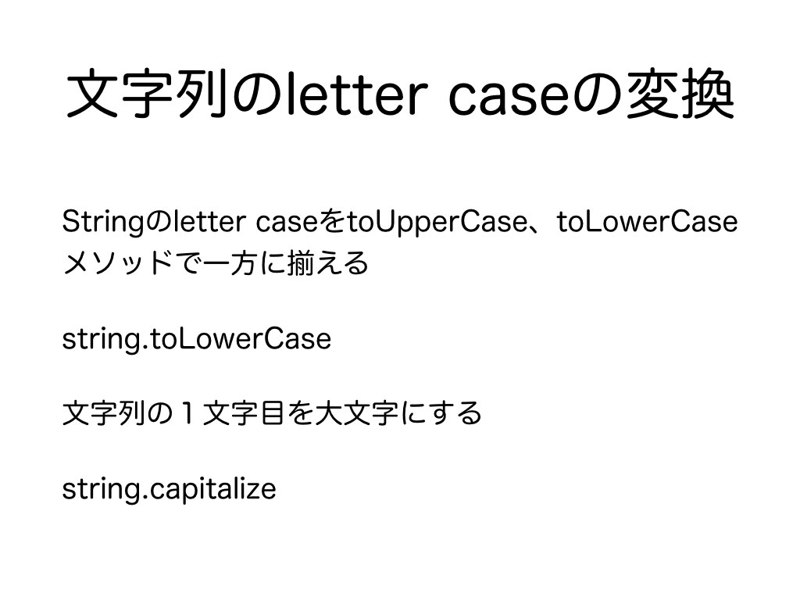<br>
Stringのletter caseをtoUpperCase、toLowerCaseメソッドで一方に揃えます。
```scala
  private val locale: Locale = Locale.JAPAN

  @Test
  def testConverseLetterCaseOfString(): Unit = {
    val letterCase: String = "letter Case string"

    assert(letterCase.toUpperCase         == "LETTER CASE STRING")
    assert(letterCase.toUpperCase(locale) == "LETTER CASE STRING")

    assert(letterCase.toLowerCase         == "letter case string")
    assert(letterCase.toLowerCase(locale) == "letter case string")

    //文字列の１文字目を大文字にする
    assert(letterCase.capitalize == "Letter Case string")
  }
```
***
<h4>1.5.4　ひらがなとカタカナの相互変換（自作）</h4>
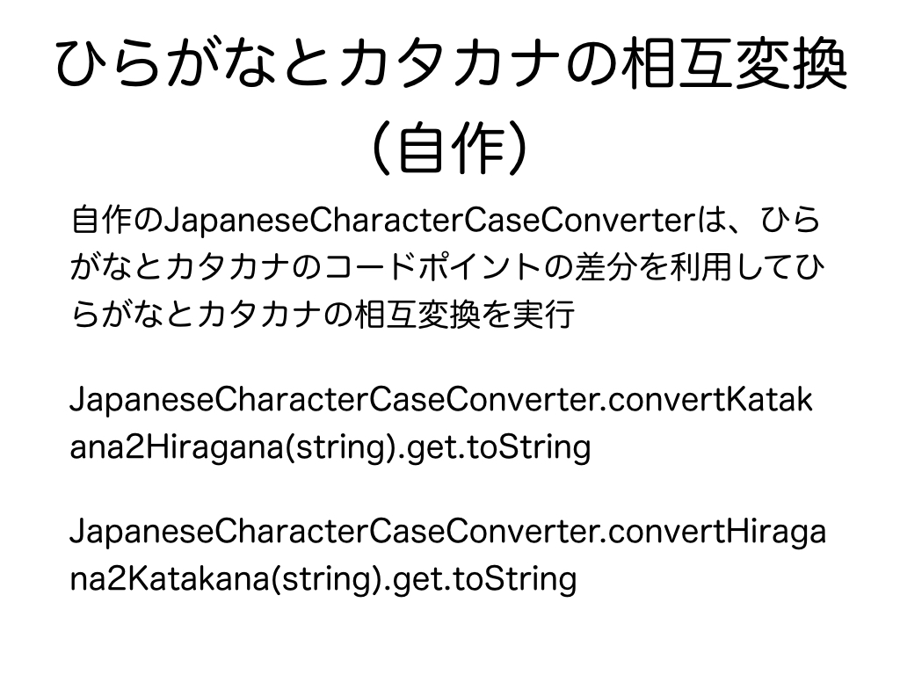<br>
自作のJapaneseCharacterCaseConverterは、ひらがなとカタカナのコードポイントの差分を利用してひらがなとカタカナの相互変換を実行します。
<a href="https://github.com/ynupc/scalastringcourseday7/blob/master/src/main/scala/text/normalizer/JapaneseCharacterCaseConverter.scala" target="_blank">JapaneseCharacterCaseConverterの実装</a>。
処理に使用するのNormalizedStringOption、NormalizedString、StringOptionについては次章で説明します。
```scala
  private val nullPoGa: NormalizedStringOption = NormalizedStringOption(NormalizedString(StringOption("「ぬるぽ」「ガッ」")))

  @Test
  def testKatakana2Hiragana(): Unit = {
    assert(JapaneseCharacterCaseConverter.convertKatakana2Hiragana(nullPoGa).get.toString == "「ぬるぽ」「がっ」")
  }

  @Test
  def testHiragana2Katakana(): Unit = {
    assert(JapaneseCharacterCaseConverter.convertHiragana2Katakana(nullPoGa).get.toString == "「ヌルポ」「ガッ」")
  }
```
***
<h3>コラム：マルチバイト文字のマッチングエラー</h3>
基本的にはScala/Javaでは起こらない問題ですし、ほぼ愚痴ですが、個人的な経験としてPerlやPHPなどでEUC-JPやShift-JISの文字の正規表現によるパターンマッチが、マルチバイト対応のメソッドを使用しないと（あるいは使用してもバグにより）失敗することがありました。２バイト文字が２つ並んだ場合、一つ目の文字（２バイト）がAB、二つ目の文字（２バイト）がCDとすると、プログラムにはABCDという文字列が見えています。ここで文字BCにパターンマッチをすると文字ABのBと文字CDのCで構成されたBCにマッチしてしまう問題が生じます。パターンマッチの失敗に加え、それをさらに置換・削除するような処理だと文字化けの原因にもなります。最近のPerl/PHPはUnicodeに対応しているようですし、新しいバージョンを使用すればそのような問題はないらしいです。（以前は正規表現が記述しやすいPerlを私は言語処理で使用しておりましたが$、@、%記号を大量にタイプしたくないのでやめました。使っていないため最近のことはよくわからないです。）
***
<h3>コラム：Shift-JISのダメ文字問題</h3>
0x5CはASCIIでバックスラッシュ記号を意味し、Shift-JISでは円記号です。
Shift-JISの文字の２バイト目に0x5Cが含まれている文字、いわゆるダメ文字があります。
0x5Cは多くのプログラミング言語でエスケープ文字として使用されているため、Shift-JISのダメ文字をソースコードや文字列処理で想定していないプログラミング言語がShift-JISを扱うとダメ文字が原因に問題が起こる可能性があります。対策として、Shift-JISを使わないかどうしても使用したい場合は「ソ」→「ソ\」のように、2バイト目の直後にエスケープ文字の0x5Cを挿入する方法があります。
<a href="https://ja.wikipedia.org/wiki/Shift_JIS#2.E3.83.90.E3.82.A4.E3.83.88.E7.9B.AE.E3.81.8C5C.E7.AD.89.E3.81.AB.E3.81.AA.E3.82.8A.E3.81.86.E3.82.8B.E3.81.93.E3.81.A8.E3.81.AB.E3.82.88.E3.82.8B.E5.95.8F.E9.A1.8C" target="_blank">Shift-JISのダメ文字（Wikipedia）</a>。
