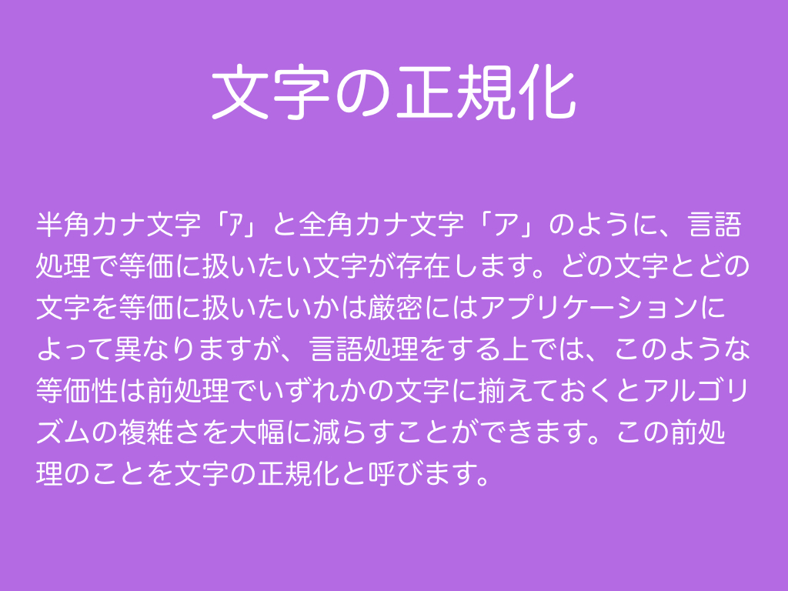
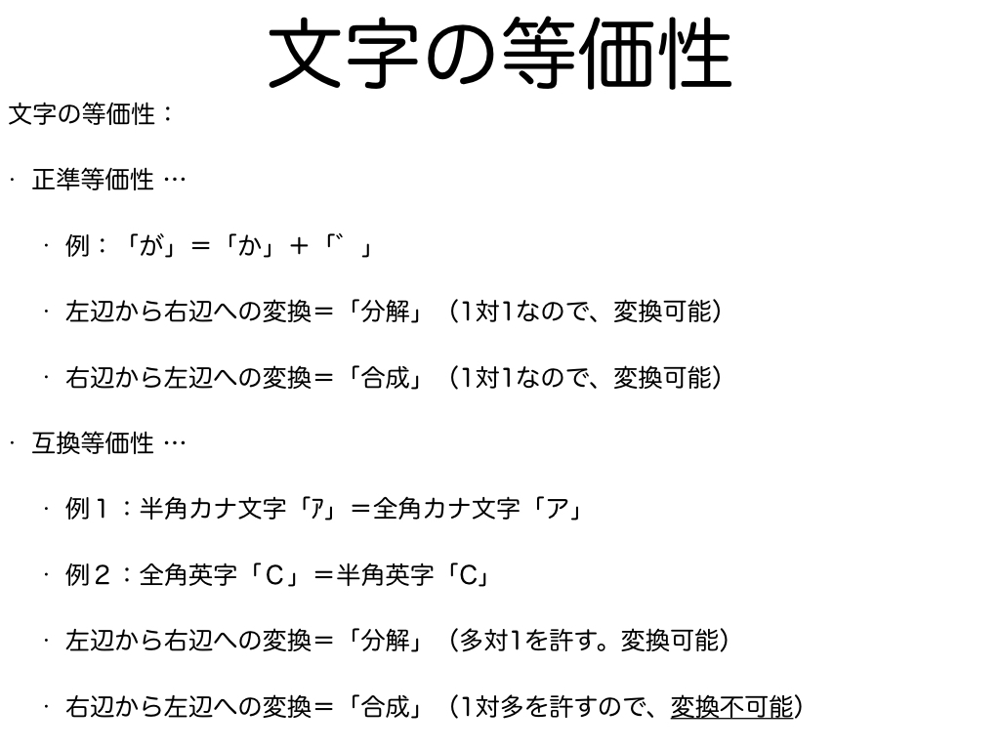
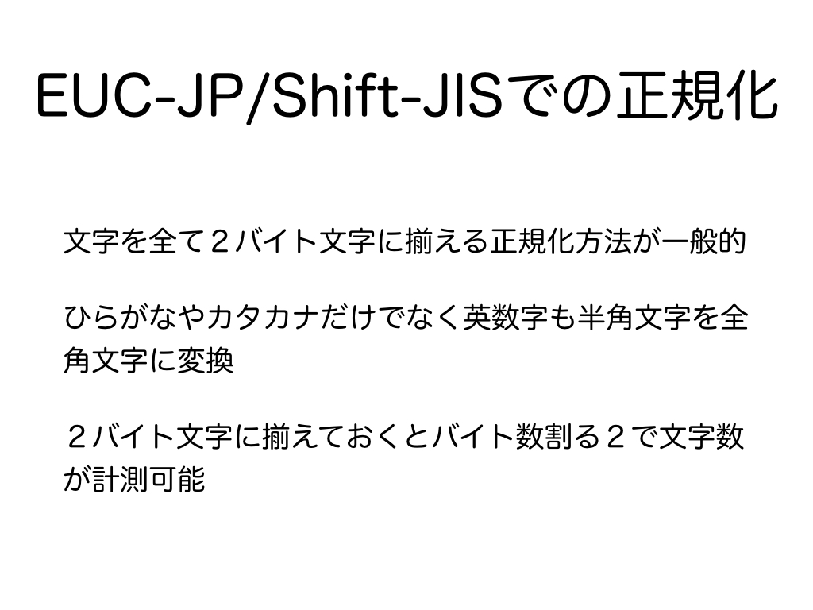
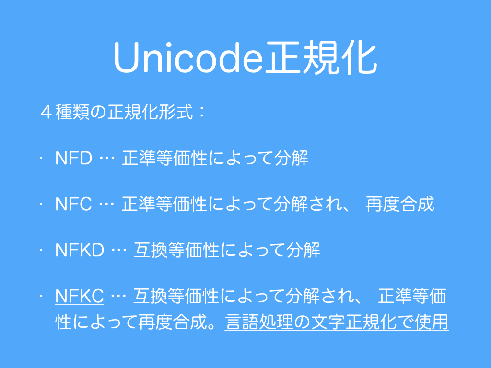
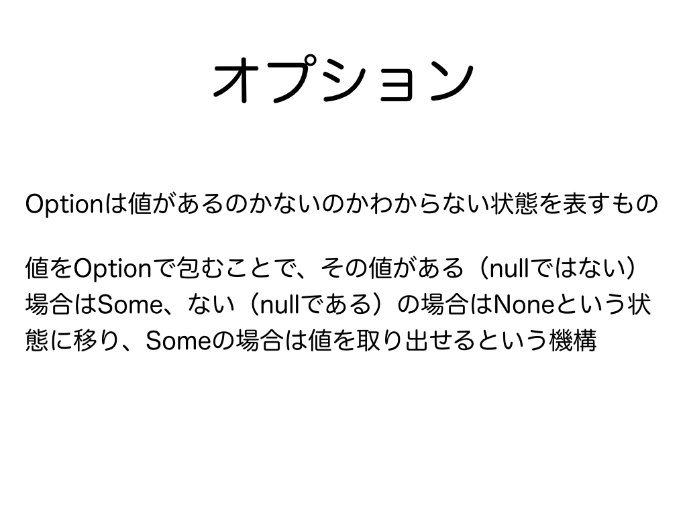
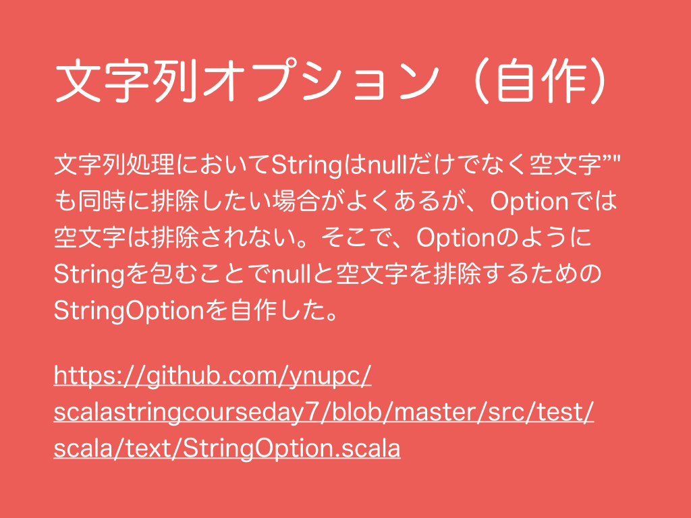
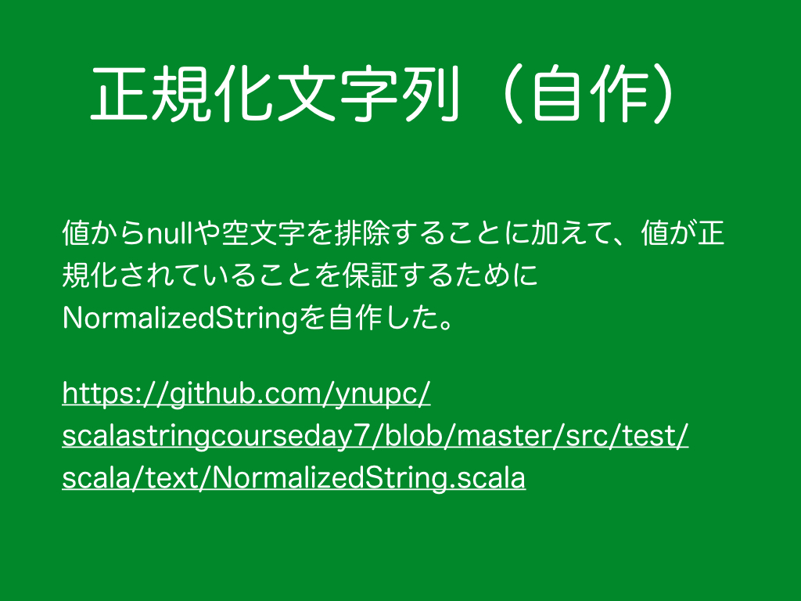
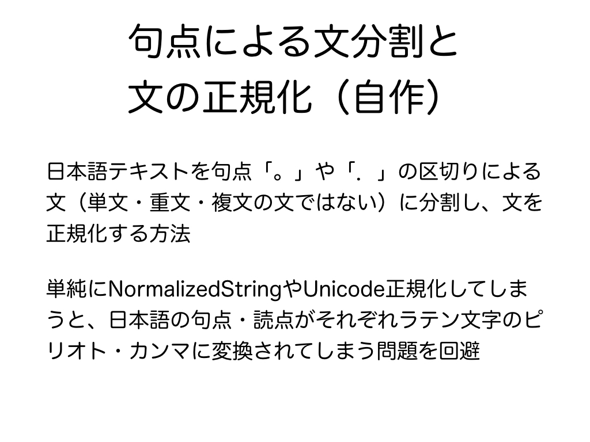

# 2.　文字の正規化
<br>
半角カナ文字「ｱ」と全角カナ文字「ア」のように、言語処理で等価に扱いたい文字が存在します。どの文字とどの文字を等価に扱いたいかは厳密にはアプリケーションによって異なりますが、言語処理をする上では、このような等価性は前処理でいずれかの文字に揃えておくとアルゴリズムの複雑さを大幅に減らすことができます。
この前処理のことを文字の正規化と呼びます。
<h3>2.1　文字の等価性</h3>
<br>
文字の等価性には正準等価性と互換等価性があります。
<h4>2.1.1　正準等価性</h4>
ダイアクリティカルマークを合成済みの文字「が」＝文字「か」＋合成用ダイアクリティカルマーク「゛」<br>
<ul>
  <li>左辺から右辺への変換＝「分解」（1対1なので、変換可能）</li>
  <li>右辺から左辺への変換＝「合成」（1対1なので、変換可能）</li>
</ul>
例：<br>
<a href="https://ja.wikipedia.org/wiki/%E3%83%80%E3%82%A4%E3%82%A2%E3%82%AF%E3%83%AA%E3%83%86%E3%82%A3%E3%82%AB%E3%83%AB%E3%83%9E%E3%83%BC%E3%82%AF" target="_blank">ダイアクリティカルマーク</a>
***
<h4>2.1.2　互換等価性</h4>
上付き文字「¹」＝普通の文字「1」<br>
下付き文字「₁」＝普通の文字「1」<br>
半角カナ文字「ｱ」＝全角カナ文字「ア」<br>
全角英字「Ｃ」＝半角英字「C」<br>
全角数字「１」＝半角数字「1」<br>
etc.<br>
<ul>
  <li>左辺から右辺への変換＝「分解」（多対1を許す。変換可能）</li>
  <li>右辺から左辺への変換＝「合成」（1対多を許すので、<strong>変換不可能</strong>）</li>
</ul>
例：<br>
<a href="https://ja.wikipedia.org/wiki/%E4%B8%8A%E4%BB%98%E3%81%8D%E6%96%87%E5%AD%97" target="_blank">上付き文字</a><br>
<a href="https://ja.wikipedia.org/wiki/%E4%B8%8B%E4%BB%98%E3%81%8D%E6%96%87%E5%AD%97" target="_blank">下付き文字</a><br>
<a href="https://ja.wikipedia.org/wiki/%E5%85%A8%E8%A7%92%E3%81%A8%E5%8D%8A%E8%A7%92" target="_blank">全角と半角</a>
***
<h3>2.2　EUC-JP/Shift-JISでの正規化</h3>
<br>
日本語文字をEUC-JPやShift-JISで扱う場合は、文字を全て２バイト文字に揃える正規化方法が一般的なために、ひらがなやカタカナだけでなく英数字も半角文字を全角文字にされます。２バイト文字に揃えておくとバイト数割る２で文字数を計測できます。EUC-JPやShift-JISで２バイト文字揃えによる正規化が一般的によく使用される理由として、EUC-JPやShift-JISがよく使用されていた過去の時代には日本語の文字列処理にPerlが使用されることが多く、PerlのStringがScalaのCharクラスやJavaのchar型のような文字境界を持つオブジェクトのシーケンスという設計にはなっていなかったという背景がある思います。<br>
<br>
例：EUC-JPを表す正規表現
```
(
                  [\\x00-\\x7F]|//コードセット０（ASCII/JIS ローマ字）
     [\\xA1-\\xFE][\\xA1-\\xFE]|//コードセット１（JIS X 0208:1997）
             \\x8E[\\xA0-\\xDF]|//コードセット２（半角片仮名）
\\x8F[\\xA1-\\xFE][\\xA1-\\xFE] //コードセット３（JIS X 0212-1990）
)
```
例：Shift-JISを表す正規表現
```
(
                                   [\\x00-\\x7F]|//ASCII/JIS ローマ字
[\\x81-\\x9F\\xE0-\\xFC][\\x40-\\x7E\\x80-\\xFC]|//JIS X 0208:1997
                                   [\\xA0-\\xDF] //半角片仮名
)
```
マルチバイト文字のマッチングエラーについては<a href="#コラムマルチバイト文字のマッチングエラー">コラム：マルチバイト文字のマッチングエラー</a>、Shift-JISのダメ文字問題については、<a href="#コラムshift-jisのダメ文字問題">コラム：Shift-JISのダメ文字問題</a>をご参照ください。
***
<h3>2.3　Unicode正規化</h3>
<br>
Unicodeには次の４種類の正規化形式が用意されています。正準等価性・互換等価性の両方によって正規化される正規化形式KCが言語処理の前処理に使用されます。
<ul>
  <li>NFD (Normalization Form Canonical Decomposition, 正規化形式D）<br>文字は正準等価性によって分解されます。</li>
  <li>NFC（Normalization Form Connonical Composition, 正規化形式C）<br>文字は正準等価性によって分解され、
再度合成されます。<br>（結果として文字の並びが変換前と変わることがありえます。）</li>
  <li>NFKD（Normalization Form Compatibility Decomposition, 正規化形式KD）<br>文字は互換等価性によって分解されます。</li>
  <li><strong>NFKC（Normalization Form Compatibility Composition, 正規化形式KC）<br>文字は互換等価性によって分解され、
正準等価性によって再度合成されます。</strong></li>
</ul>
***
<h3>2.4　オプション</h3>
<br>
Optionは値があるのかないのかわからない状態を表すものです。値をOptionで包むことで、その値がある（nullではない）場合はSome、ない（nullである）の場合はNoneという状態に移り、Someの場合は値を取り出せるという機構です。nullを記述せずにすむため、NullPointerExceptionを排除に使えます。Optionで包まれた値を取り出す方法は主に３つあります。
<ol>
  <li>match-case文を利用する方法</li>
  <li>isEmpty/nonEmptyでNoneを排除後に、getで値を取り出す方法</li>
  <li>getOrElseで取り出せなかった時（elseの時）に返すデフォルト値を事前に用意してから値を取り出す方法</li>
</ol>
```scala
  private val wordVariants: String = "スパゲッティ,スパゲッティー,スパゲッテイ,スパゲティ,スパゲティー,スパゲテイ"
  private val nullString: String = null
  private val emptyString: String = ""

  @Test
  def testOption(): Unit = {
    assert(Option(wordVariants).nonEmpty)
    assert(Option(nullString).isEmpty)
    assert(Option(emptyString).nonEmpty)

    Option(wordVariants) match {
      case Some(str) =>
        assert(str == wordVariants)
      case None =>
        assert(false)
    }

    Option(emptyString) match {
      case Some(str) =>
        assert(str == emptyString)
      case None =>
        assert(false)
    }
    
    val wordVariantsOpt: Option[String] = Option(wordVariants)
    if (wordVariantsOpt.nonEmpty) {
      assert(wordVariantsOpt.get == wordVariants)
    }

    val nullStringOpt: Option[String] = Option(nullString)
    assert(nullStringOpt.getOrElse("ゲッティ") == "ゲッティ")
  }
```
***
<h3>2.5　文字列オプション（自作）</h3>
<br>
Optionを使用するとnullを書かずにすむためNullPointerExceptionを排除するために使用できます。文字列処理においてStringはnullだけでなく空文字""も同時に排除したい場合がよくありますが、Optionでは空文字は排除されません。そこで、OptionのようにStringを包むことでnullと空文字を排除するためのStringOptionを自作しました。<a href="https://github.com/ynupc/scalastringcourseday7/blob/master/src/main/scala/text/normalizer/StringOption.scala" target="_blank">StringOptionの実装</a>。
```scala
  @Test
  def testStringOption(): Unit = {
    assert(StringOption(wordVariants).nonEmpty)
    assert(StringOption(nullString).isEmpty)
    assert(StringOption(emptyString).isEmpty)

    StringOption(wordVariants) match {
      case StringSome(str) =>
        assert(str == wordVariants)
      case StringNone =>
        assert(false)
    }

    StringOption(emptyString) match {
      case StringSome(str) =>
        assert(false)
      case StringNone =>
        assert(true)
    }
  }
```
***
<h3>2.6　正規化文字列（自作）</h3>
<br>
値からnullや空文字を排除することに加えて、値が正規化されていることを保証するためにNormalizedStringを自作しました。<a href="https://github.com/ynupc/scalastringcourseday7/blob/master/src/main/scala/text/normalizer/NormalizedString.scala" target="_blank">NormalizedStringの実装</a>
<h4>2.6.1　正規化処理の流れ</h4>
NormalizedStringの正規化処理は次の順序で４段階で実行されます。
<ol>
  <li>Unicode正規化前の辞書による文字の正規化</li>
  <li>Unicode正規化</li>
  <li>Unicode正規化後の辞書による文字の正規化</li>
  <li>辞書による単語の異表記からの代表表記への置換</li>
</ol>
<h4>2.6.2　ファイル構成</h4>
NormalizedStringは辞書ファイルとプログラムファイルから構成されています。それぞれについて含まれているファイルとその説明は次です。
<ul>
  <li>設定
    <ul>
      <li>reference.conf<br>正規化用辞書ディレクトリnormalizerを下位に持つresourcesディレクトリへのパスを設定するためのファイル<br>resourcesDir = ../../src/main/resources/</li>
    </ul>
  </li>
  <li>辞書
    <ul>
      <li>character_dic_after_unicode_normalization.yml<br>「Unicode正規化後の辞書による文字の正規化」で使用する辞書</li>
      <li>character_dic_before_unicode_normalization.yml<br>「Unicode正規化前の辞書による文字の正規化」で使用する辞書</li>
      <li>word_expression_dic.yml<br>「辞書による単語の異表記からの代表表記への置換」で使用する辞書</li>
    </ul>
  </li>
  <li>プログラム
    <ul>
      <li>CharacterNormalizerAfterUnicodeNormalization.scala<br>「Unicode正規化後の辞書による文字の正規化」で使用するプログラム</li>
      <li>CharacterNormalizerBeforeUnicodeNormalization.scala<br>「Unicode正規化前の辞書による文字の正規化」で使用するプログラム</li>
      <li>DictionaryBasedNormalizer.scala<br>DictionaryBasedNormalizerは、CharacterNormalizerBeforeUnicodeNormalization、CharacterNormalizerAfterUnicodeNormalization、WordExpressionNormalizerが継承するクラス</li>
      <li>NormalizedString.scala<br>NormalizedStringの本体。「NormalizedStringの正規化処理の流れ」に従い、CharacterNormalizerBeforeUnicodeNormalization、java.text.Normalizer、CharacterNormalizerAfterUnicodeNormalization、WordExpressionNormalizerを順に実行する。</li>
      <li>WordExpressionNormalizer.scala<br>「辞書による単語の異表記からの代表表記への置換」で使用するプログラム</li>
    </ul>
  </li>
</ul>
NormalizedStringに関する辞書ファイルとプログラムファイルについて、リポジトリ内のディレクトリ構成図は次です。
```
scalastringcourseday7/
 ├ src/
 │  └ main/
 │    ├ resources/
 │    │   ├ reference.conf
 │    │   ├ normalizer/
 │    │   …   ├ character_dic_after_unicode_normalization.yml
 │    │       ├ character_dic_before_unicode_normalization.yml
 │    │       └ word_expression_dic.yml
 │    └ scala/
 │        ├ text/
 │        │   ├ normalizer
 │        │   …   ├ CharacterNormalizerAfterUnicodeNormalization.scala
 │        │       ├ CharacterNormalizerBeforeUnicodeNormalization.scala
 │        │       ├ DictionaryBasedNormalizer.scala
 │        │       ├ NormalizedString.scala
 │        │       ├ WordExpressionNormalizer.scala
 │        │       └ …
 │        └ …
 …
 ```
 <h4>2.6.3　辞書ファイルのフォーマット</h4>
 AやBやCをDに置換し、EやFをGに置換したい場合は次のように記述します。
 ```
 D:[A,B,C]
 G:[E,F]
 ```
 Unicodeシーケンスで記述することができます。これにより、見た目が似ている文字もコードポイントにより明示的に区別することができます。「#」記号を使うことでコメントアウトすることができます。これにより、例えば、Unicodeシーケンンスで記述した文字をnativeな文字でコメントアウト内に記述したり、置換規則（行）の使用をコメントアウトにより管理することができます。現状では「#」記号と「:」記号を置換する・される文字・文字列内で記述することができません。<br>
「Unicode正規化後の辞書による文字の正規化」で使用する辞書ファイル（<a href="https://github.com/ynupc/scalastringcourseday7/blob/master/src/main/resources/normalizer/character_dic_before_unicode_normalization.yml" target="_blank">character_dic_before_unicode_normalization.yml</a>）
 ```
 \uFF5E:[\u301C,\u007E]#波線記号の統一,～,〜,~
#\u309B:[\u3099]#濁点の統一,゛,゙
 ```
次のように「""」を使用することで、マッチする文字・文字列を削除（空文字に置換）することができます。<br>
「Unicode正規化前の辞書による文字の正規化」で使用する辞書ファイル（<a href="https://github.com/ynupc/scalastringcourseday7/blob/master/src/main/resources/normalizer/character_dic_after_unicode_normalization.yml" target="_blank">character_dic_after_unicode_normalization.yml</a>）
 ```
"":[\u003D,\uFF1D]#イコール記号の削除,=,＝
"":[\u30FB]#中黒の削除,・
 ```
word_expression_dic.ymlでは、次のように異表記を代表表記に変換できます。この辞書ファイルのみ、置き換えたい文字列を正規表現で記述することができます。同時に正規表現で記述できるためエスケープシーケンスに注意が必要です。<br>
「辞書による単語の異表記からの代表表記への置換」で使用する辞書ファイル（<a href="https://github.com/ynupc/scalastringcourseday7/blob/master/src/main/resources/normalizer/word_expression_dic.yml" target="_blank">word_expression_dic.yml</a>）
```
タンパク質:[たんぱく質,蛋白質]
スパゲッティ:[スパゲッティー,スパゲッテイ,スパゲティ,スパゲティー,スパゲテイ]
```
<h4>2.6.4　辞書ファイルの置換規則の実行順序</h4>
実行順序は代表表記の順序が異表記の順序より優先されます。
「Unicode正規化後の辞書による文字の正規化」と「Unicode正規化前の辞書による文字の正規化」で使用する辞書ファイルについては、代表表記・異表記ともにUTF-16BEの順です。「辞書による単語の異表記からの代表表記への置換」で使用する辞書ファイルについては、代表表記・異表記ともにUTF-16BEの順に並べた後、文字列のlength（Char数）で並べています。代表表記はlengthで昇順、異表記は降順です。それぞれWordExpressionNormalizerのsortRepresentationsメソッドとsortNotationVariantsメソッドを書き換えることで順序を変更することができます。

<h4>2.6.5　懸念事項</h4>
このように表層的なパターンマッチによる置換で異表記を代表表記に統一する場合、単語境界が考慮されないので問題が起こる場合が懸念されます。例えば、「横浜国立大」を「横浜国立大学」に置換すると「横浜国立大学」が「横浜国立大学学」に誤変換したり、パターンマッチによって「横浜国立大学」の場合には誤変換を起こさないように正規表現を記述しても「パシフィコ横浜国立大ホール」（「パシフィコ横浜」＋「国立」＋「大ホール」であり、「横浜国立大学」が所有するホールではない）が「パシフィコ横浜国立大学ホール」に誤変換されるような場合が懸念されます。「國大生」は國學院大學の学生を指し、「国大生」は国立大学や横浜国立大学や國學院大學などの学生を指します。「國」を「国」に正規化すると「國大生」がより曖昧な語である「国大生」になってしまいます。正規化処理・表層的な文字列置換により作成したいアプリケーションの目的に反することが起きないよう、あるいは個々の正規化規則により得られるメリットとデメリットのバランスを考えて注意深く正規化の設計・保守・管理する必要があります。<br>
<br>
互換等価性に関するサンプルコード
```scala
  //\u30AC = 全角カタカナの「ガ」
  private val sOfU30AC = "\u30AC"
  //\u30AB = 全角カタカナの「カ」
  private val sOfU30AB = "\u30AB"
  //\uFF76 = 半角カタカナの「ｶ」
  private val sOfUFF76 = "\uFF76"
  //\u30F5 = 小書の全角カタカナの「ヵ」
  private val sOfU30F5 = "\u30F5"
  //\u32D5 = 丸囲いカタカナの「㋕」
  private val sOfU32D5 = "\u32D5"
  //\u309B = 全角濁点の「゙」
  private val sOfU309B = "\u309B"
  //\u3099 = 全角濁点の「゛」
  private val sOfU3099 = "\u3099"
  //\uFF9E = 半角濁点の「ﾞ」
  private val sOfUFF9E = "\uFF9E"
  
  @Test
  def testNormalizedStringOfCompatibilityEquivalent(): Unit = {
    //カ
    val nsOfU30AB: NormalizedString = NormalizedString(StringOption(sOfU30AB))
    val nsOfUFF76: NormalizedString = NormalizedString(StringOption(sOfUFF76))
    val nsOfU30F5: NormalizedString = NormalizedString(StringOption(sOfU30F5))
    val nsOfU32D5: NormalizedString = NormalizedString(StringOption(sOfU32D5))
    //濁点
    val nsOfU309B: NormalizedString = NormalizedString(StringOption(sOfU309B))
    val nsOfU3099: NormalizedString = NormalizedString(StringOption(sOfU3099))
    val nsOfUFF9E: NormalizedString = NormalizedString(StringOption(sOfUFF9E))

    assert(nsOfU30AB.toString == sOfU30AB)
    assert(nsOfU30AB == nsOfUFF76)
    assert(nsOfU30AB != nsOfU30F5)
    assert(nsOfU30AB == nsOfU32D5)

    assert(nsOfU3099.toString == sOfU3099)
    assert(nsOfU3099 == nsOfUFF9E)
    assert(nsOfU3099 != nsOfU309B)
    assert(nsOfUFF9E != nsOfU309B)
  }
```
正準等価性に関するサンプルコード
```scala
  //\u30AC = 全角カタカナの「ガ」
  private val sOfU30AC = "\u30AC"
  //\u30AB = 全角カタカナの「カ」
  private val sOfU30AB = "\u30AB"
  //\uFF76 = 半角カタカナの「ｶ」
  private val sOfUFF76 = "\uFF76"
  //\u30F5 = 小書の全角カタカナの「ヵ」
  private val sOfU30F5 = "\u30F5"
  //\u32D5 = 丸囲いカタカナの「㋕」
  private val sOfU32D5 = "\u32D5"
  //\u309B = 全角濁点の「゙」
  private val sOfU309B = "\u309B"
  //\u3099 = 全角濁点の「゛」
  private val sOfU3099 = "\u3099"
  //\uFF9E = 半角濁点の「ﾞ」
  private val sOfUFF9E = "\uFF9E"

  @Test
  def testNormalizedStringOfCanonicalEquivalent(): Unit = {
    val nsOfU30AC: NormalizedString = NormalizedString(StringOption(sOfU30AC))

    val nsOfU30ABU309B: NormalizedString = NormalizedString(StringOption(sOfU30AB concat sOfU309B))
    val nsOfU30ABU3099: NormalizedString = NormalizedString(StringOption(sOfU30AB concat sOfU3099))
    val nsOfU30ABUFF9E: NormalizedString = NormalizedString(StringOption(sOfU30AB concat sOfUFF9E))

    val nsOfUFF76U309B: NormalizedString = NormalizedString(StringOption(sOfUFF76 concat sOfU309B))
    val nsOfUFF76U3099: NormalizedString = NormalizedString(StringOption(sOfUFF76 concat sOfU3099))
    val nsOfUFF76UFF9E: NormalizedString = NormalizedString(StringOption(sOfUFF76 concat sOfUFF9E))

    val nsOfU30F5U309B: NormalizedString = NormalizedString(StringOption(sOfU30F5 concat sOfU309B))
    val nsOfU30F5U3099: NormalizedString = NormalizedString(StringOption(sOfU30F5 concat sOfU3099))
    val nsOfU30F5UFF9E: NormalizedString = NormalizedString(StringOption(sOfU30F5 concat sOfUFF9E))

    val nsOfU32D5U309B: NormalizedString = NormalizedString(StringOption(sOfU32D5 concat sOfU309B))
    val nsOfU32D5U3099: NormalizedString = NormalizedString(StringOption(sOfU32D5 concat sOfU3099))
    val nsOfU32D5UFF9E: NormalizedString = NormalizedString(StringOption(sOfU32D5 concat sOfUFF9E))

    assert(nsOfU30AC.toString == sOfU30AC)

    assert(nsOfU30AC != nsOfU30ABU309B)
    assert(nsOfU30AC == nsOfU30ABU3099)
    assert(nsOfU30AC == nsOfU30ABUFF9E)

    assert(nsOfU30AC != nsOfUFF76U309B)
    assert(nsOfU30AC == nsOfUFF76U3099)
    assert(nsOfU30AC == nsOfUFF76UFF9E)

    assert(nsOfU30AC != nsOfU30F5U309B)
    assert(nsOfU30AC != nsOfU30F5U3099)
    assert(nsOfU30AC != nsOfU30F5UFF9E)

    assert(nsOfU30AC != nsOfU32D5U309B)
    assert(nsOfU30AC == nsOfU32D5U3099)
    assert(nsOfU30AC == nsOfU32D5UFF9E)
  }
```
文字列の正規化に関するサンプルコード（単語異表記を代表表記に置換）
```scala
  private val wordVariants: String = "スパゲッティ,スパゲッティー,スパゲッテイ,スパゲティ,スパゲティー,スパゲテイ"
  
  @Test
  def testNormalizedString(): Unit = {
    NormalizedString(StringOption(wordVariants)).toStringOption match {
      case StringSome(str) =>
        assert(str == "スパゲッティ,スパゲッティ,スパゲッティ,スパゲッティ,スパゲッティ,スパゲッティ")
      case StringNone =>
        assert(false)
    }
  }
```
***
<h3>2.7　日本語の句点による文分割と文の正規化（自作）</h3>
<br>
日本語テキストを句点「。」や「．」の区切りによる文（単文・重文・複文の文ではない）に分割し、文を正規化する方法について説明します。単純に日本語テキストを上記のNormalizedStringやUnicode正規化してしまうと、日本語の句点・読点がそれぞれラテン文字のピリオト・カンマに変換されてしまいます。例えば、日本語テキストに小数点のピリオドや数字の桁区切りのカンマなどが混在している場合、正規化後のテキストのピリオドが日本語の句点を意味していたのか小数点のピリオドを意味していたのかわかりづらくなってしまいます。そこで、正規化する際に日本語の句点・読点を一旦退避させて、それらを正規化後に元の位置に戻すような処理を含めた文分割処理を作成しました。「モーニング娘。」のような固有名詞に句点が含まれている場合は正規化処理から退避させることに加え、句点による文分割の処理からも退避させる必要があります。<a href="https://github.com/ynupc/scalastringcourseday7/blob/master/src/main/resources/normalizer/proper_noun_with_japanese_period.txt" target="_blank">proper_noun_with_japanese_period.txt</a>に登録した句点を含む固有名詞の句点は文分割処理の前に一時的に幽霊文字に変換し、文分割処理後に元の句点に戻します。<a href="https://github.com/ynupc/scalastringcourseday7/blob/master/src/main/scala/text/parser/JapaneseSentenceSplitter.scala" target="_blank">JapaneseSentenceSplitterの実装</a>。
```scala
  @Test
  def testNormalizedSentence(): Unit = {
    val text: String = """2005年にカンザス州教育委員会では、公教育において進化論と同様にインテリジェント・デザイン（ID説）の立場も教えなければいけないという決議が評決されることになっていた。前年の教育委員の改選で委員6人中4人を保守派が占めており、可決は確実と見られていた。これに抗議するために、2005年6月、アメリカ合衆国のオレゴン州立大学物理学科卒業生のボビー・ヘンダーソンは公開質問状を提出した。ヘンダーソンは自分のサイト "venganza.org" （スペイン語で復讐の意）において空飛ぶスパゲッティー・モンスターの概略を示して、明らかな証拠や、それに基づいて進化を説明できる十分な論理性・整合性があると論じ、創造論の一部として「空飛ぶスパゲティ・モンスター」を進化論やID説と同様に公立高校で教えることを公開質問状において提案した。"""
    val sentences = JapaneseSentenceSplitter.split(StringOption(text))
    //sentencesの型はSeq[NormalizedSentence]だが、NormalizedSentenceの型にはここからアクセスできないため、型を明示的に書けない。

    assert(sentences.length == 4)
    assert(sentences.head.text == """2005年にカンザス州教育委員会では、公教育において進化論と同様にインテリジェントデザイン(ID説)の立場も教えなければいけないという決議が評決されることになっていた。""")
    assert(sentences(1).text   == """前年の教育委員の改選で委員6人中4人を保守派が占めており、可決は確実と見られていた。""")
    assert(sentences(2).text   == """これに抗議するために、2005年6月、アメリカ合衆国のオレゴン州立大学物理学科卒業生のボビーヘンダーソンは公開質問状を提出した。""")
    assert(sentences.last.text == """ヘンダーソンは自分のサイト "venganza.org" (スペイン語で復讐の意)において空飛ぶスパゲッティモンスターの概略を示して、明らかな証拠や、それに基づいて進化を説明できる十分な論理性整合性があると論じ、創造論の一部として「空飛ぶスパゲッティモンスター」を進化論やID説と同様に公立高校で教えることを公開質問状において提案した。""")

    assert(JapaneseSentenceSplitter.split(StringOption("、")).isEmpty)
    assert(JapaneseSentenceSplitter.split(StringOption("、、")).isEmpty)
    assert(JapaneseSentenceSplitter.split(StringOption("、、。")).isEmpty)
    assert(JapaneseSentenceSplitter.split(StringOption("、。、")).isEmpty)
    assert(JapaneseSentenceSplitter.split(StringOption("。、、")).isEmpty)
    assert(JapaneseSentenceSplitter.split(StringOption("。")).isEmpty)
    assert(JapaneseSentenceSplitter.split(StringOption("。。")).isEmpty)
  }
```
